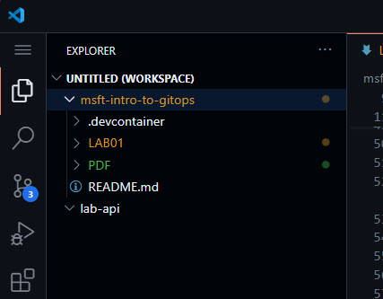

# Lab Guide #

## Create and Clone Directory ##

1. First we need to update our GITHUB_TOKEN with the version stored in our CodeSpaces Secrets. You do this by running the following command in the Terminal. This will allow us to authenticate to GitHub beyond our current project/repo that you just cloned ```msft-intro-to-gitops```. 

    ```sh
    GITHUB_TOKEN=$CONFIG_GITHUB_TOKEN
    ```
---
2. Use the gh repo create command to create a new repository named lab-api:

    ```sh
    gh repo create lab-api --public --add-readme
    ```

    > Here's an explanation of how the above commands work. 
    >>- ```--public```: makes the repository public (you can omit this if you want it private).
    >>- ```--clone```**(OPTIONAL)**: tells GitHub CLI to clone the repository to your local environment immediately after creating it. 
    >>- ```--add-readme```: Tells GitHub CLI to make sure the new repo includes a default README.md document in the main branch. *_Every Repo should have a default README.md_*.
---
3. Now lets collect the Repo URL so we can use git to clone it down to our local system: _(the previous step's output would have included the URL. But it is good to know how to retrieve it should you need too.)_

    ```sh
    gh repo view lab-api --json url --jq '.url'
    ```
    ```sh
    # OUTPUT:
    # It will however have your GitHub Account information. 
    # Copy the web address provided by your output, you'll need that for the next step
    @BenTheBuilder-MSFTLabs ➜ /workspaces $ gh repo view lab-api --json url --jq '.url'
    https://github.com/BenTheBuilder-MSFTLabs/lab-api
    ```
    > Here's an explanation of how the above commands work. 
    >>- ```gh repo view```: This tells GitHub CLI to view details about a repository.
    >>- ```lab-api```: This is the name of the repository you are trying to view. In this case, it's a repository named lab-api. 
    >>- ```--json```: This option specifies that you want to get the repository's data in JSON format.
    >>- ```url```: This tells GitHub CLI that you only want to retrieve the URL of the repository in the JSON output.
    >>- ```---jq '.url'```: This flag is used to filter the JSON output using a JQ expression. jq is a lightweight and flexible command-line JSON processor that allows you to extract and manipulate JSON data easily. It tells jq to extract the value of the url key from the JSON response.
---
4. Clone the repository you created on GitHub to your local development environment and add it to your Visual Studio Code workspace.

    Use the ```cd``` or (Change Directory) command to move you up one directory level to '/workspaces' in your current file system. You don't want to add another Repository inside an existing one. 
    ```sh
    cd .. 
    ```

    The ```git clone``` command uses Git to clone the repository from the specified URL to your local machine. Cloning creates a local copy of the repository, including all its files and history. 

    ```repo
    git clone https://github.com/BenTheBuilder-MSFTLabs/lab-api
    ```
    ```sh
    # OUTPUT:
    @BenTheBuilder-MSFTLabs ➜ /workspaces $ git clone https://github.com/BenTheBuilder-MSFTLabs/lab-api
    Cloning into 'lab-api'...
    warning: You appear to have cloned an empty repository.
    ```

    After cloning the repo down, ```cd lab-api``` navigates into the newly created lab-api directory, which contains the cloned repository.

    ```sh
    cd lab-api
    ```
    ```sh
    # OUTPUT:
    # Notice the prompt changed to indicate you are in the (main) branch of the lab-api repo. 
    @BenTheBuilder-MSFTLabs ➜ /workspaces/lab-api (main) $  
    ```

    This command opens the current directory ($PWD, which stands for "Present Working Directory") in Visual Studio Code and adds it to the existing workspace. The -a flag ensures that the directory is added to the current workspace instead of replacing it.

    ```sh
    code -a $PWD
    ```

    Your workspace in VSCode should now contain two working directories. ```msft-intro-to-gitops``` and ```lab-api```, the latter of which is currently empty.

    

---
# End of Lab 

[⬅ Back to LABGUIDE](LABGUIDE.md) | [Next to LAB02 ➡](LAB02.md)