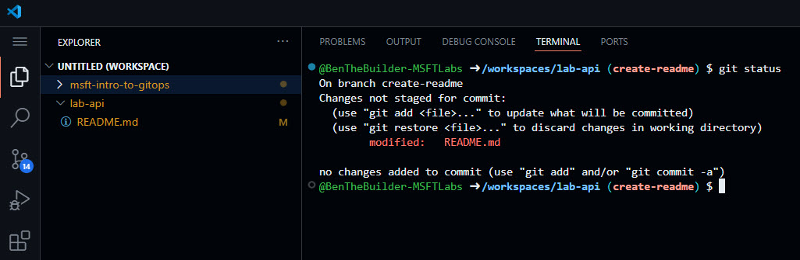
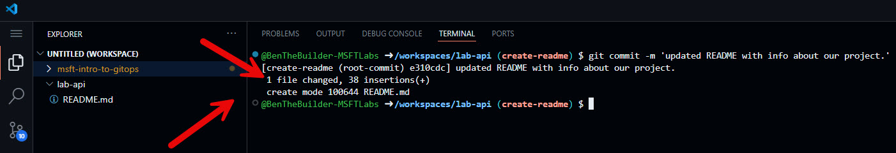
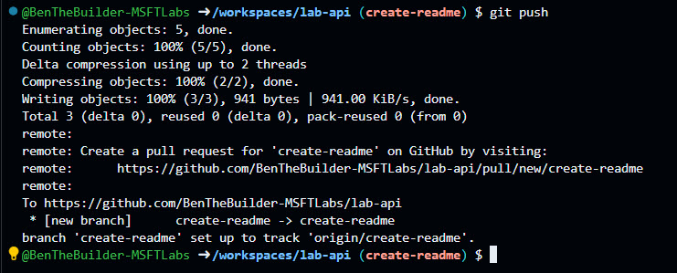
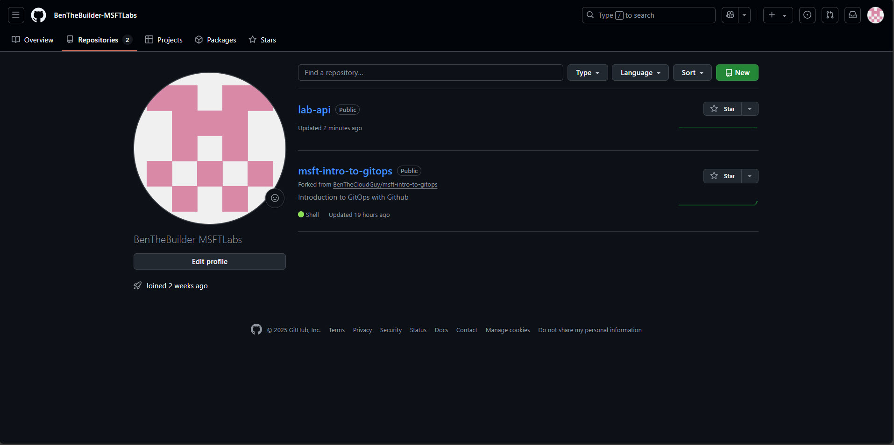
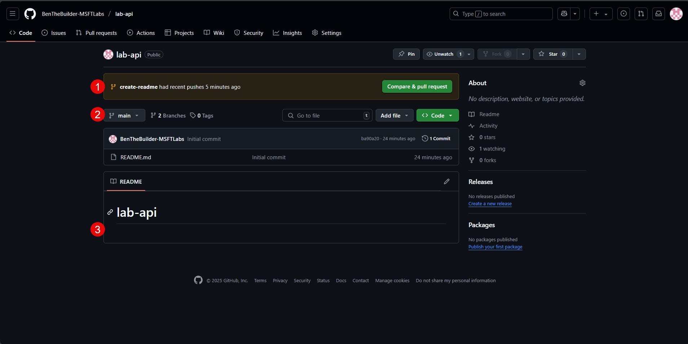
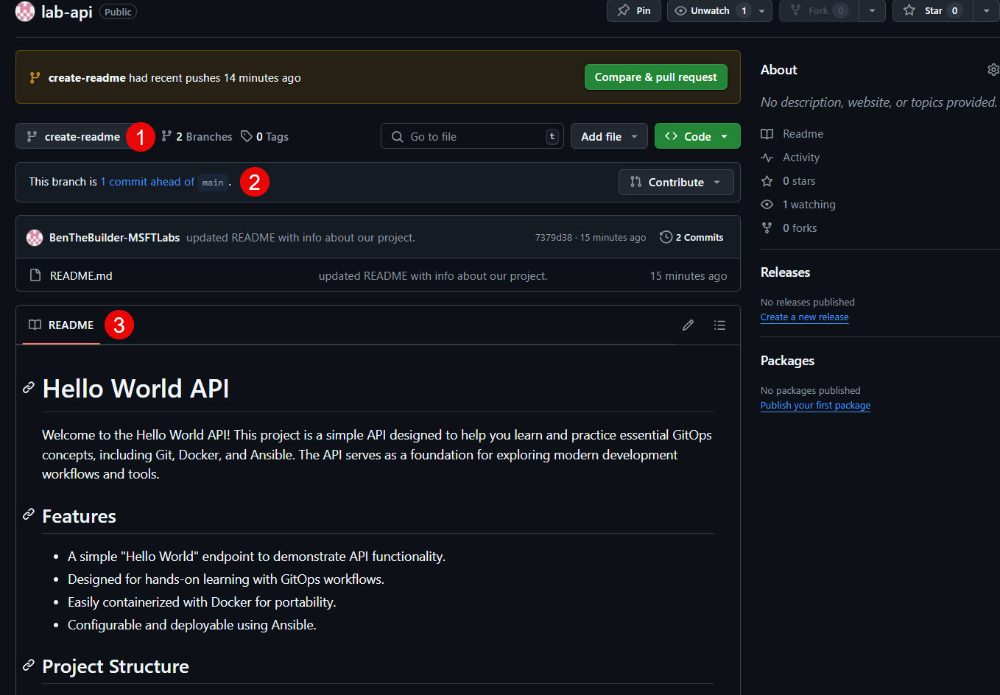
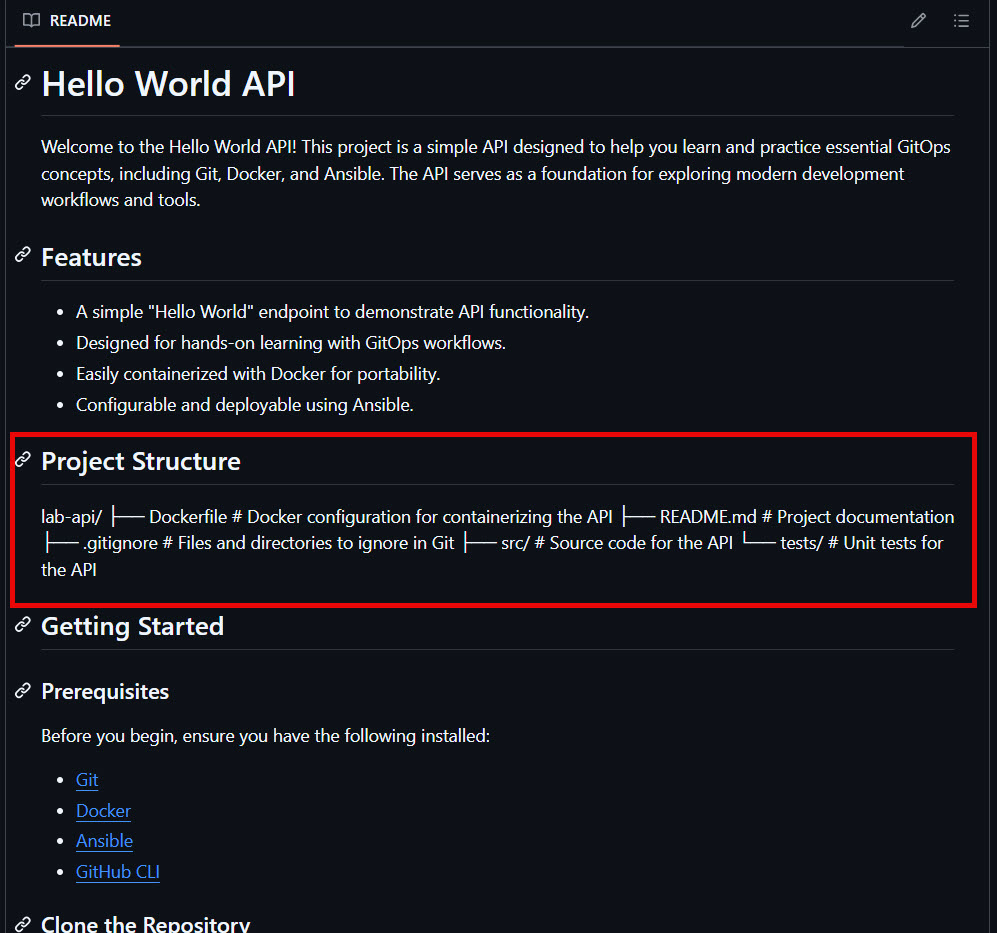

# Lab Guide #


## Create New Working Branch ##

In this step we are going to create a new branch in our local repository called 'create-readme'. It is important to not commit directly to main (in fact most organizations prevent this via policy). So we need to create a branch for any features/changes we want to make. We'll use this branch for the next few steps. 

1.  To create a branch and check it out in single command you would use ```git checkout -b <branch-name>```.

    ```sh 
    git checkout -b create-readme
    ```
    ```sh
    # TERMINAL OUTPUT:
    # Notice that by using -b switch we created the branch and switched to it in a single command. 
    # The prompt changed to show our new active branch. 
    @BenTheBuilder-MSFTLabs ➜ /workspaces/lab-api (main) $ git checkout -b create-readme
    Switched to a new branch 'create-readme'
    @BenTheBuilder-MSFTLabs ➜ /workspaces/lab-api (create-readme) $ 
    ```
---

## Update README ##

In this step, you will update the default README.md file to make it more informative and useful. A good README.md typically includes key information about the project, such as its description, features, how to contribute, getting started instructions, and licensing details. To save time, you can use tools like GitHub Copilot to help generate content for your README.

Start by copying the provided content into your README.md file. This content introduces the "Hello World API" project, highlights its features, outlines the project structure, and provides prerequisites and licensing information. Open the README.md file in the lab-api directory in Visual Studio Code, paste the content, and save the changes using Ctrl + S.

Next, check the status of your local repository using the git status command. You will notice that README.md is marked as modified but not yet staged for commit. Stage the file using git add README.md, then commit the changes with a descriptive message using git commit -m 'updated README with info about our project.'. Finally, push the changes to the remote repository using git push. If you encounter an error indicating that the branch does not have an upstream branch, configure Git to automatically set up the remote branch by running git config --global push.autoSetupRemote true. Then, run git push again to successfully push the changes.

After completing these steps, visit your GitHub repository to verify the updated README.md file. If you notice any formatting issues, such as the project structure not displaying correctly, return to your local repository, fix the issue (e.g., by adding a code block around the project structure), and push the changes again. 

1. The default README isn't very useful so let's add some content that helps people understand what our repo\project does. Typically your REPO would include some key information, such as Description, Features, How to contribute, Getting Started, License Inforation, etc etc. 

    > **NOTE**  
    > Using Github Co-Pilot to help write README is a great time saving feature.. We'll talk more about Github Co-Pilot later. 

    Copy/Paste the following into your README.md. 

    ```txt
    # Hello World API

    Welcome to the Hello World API! This project is a simple API designed to help you learn and practice essential GitOps concepts, including Git, Docker, and Ansible. The API serves as a foundation for exploring modern development workflows and tools.

    ## Features

    - A simple "Hello World" endpoint to demonstrate API functionality.
    - Designed for hands-on learning with GitOps workflows.
    - Easily containerized with Docker for portability.
    - Configurable and deployable using Ansible.

    ## Project Structure

    lab-api/
    ├── Dockerfile       # Docker configuration for containerizing the API
    ├── README.md        # Project documentation
    ├── .gitignore       # Files and directories to ignore in Git
    ├── src/             # Source code for the API
    └── tests/           # Unit tests for the API

    ## Getting Started

    ### Prerequisites

    Before you begin, ensure you have the following installed:

    - [Git](https://git-scm.com/)
    - [Docker](https://www.docker.com/)
    - [Ansible](https://www.ansible.com/)
    - [GitHub CLI](https://cli.github.com/)

    ### Clone the Repository

    To get started, clone the repository to your local machine. 

    ## License

    This project is licensed under the MIT License. See the `LICENSE` file for details.
    ```

    In VSCODE workspaces under ```lab-api```, click README.md to open in Editor. Then ```paste``` the content from the above code block. It should look like this when done.
    
    > **NOTE**  
    > _Don't forget to save the changes by hitting ```ctrl``` + ```s```._

    

    let's check the status of our local repo and see how things stand. Again we do this with ```git status```

    ```sh
    git status
    ```

    > Notice that README.md is now marked as 'modified:' (that is what the orange ```M``` means)<br>
    > The file is in RED because it isn't staged _(Changes not staged for commit:)_
    > 

---

2.  Now that we have our updated README ready it is time to stage and commit those changes and do our first ```git push``` to our remote repository in Github. 

    First we need to stage our README.md using ```git add``` command. 
    ```sh
    git add README.md
    ```
    > OUTPUT: <br>
    > When you execute ```git add README.md``` you'll see the color of the file change to a slightly lighter shade of orance. ```git status``` now shows the file is staged _(Changes to be committed:)_
    >

    Now we need to commit our staged files to our local Repository using ```git commit```. 
    ```sh
    git commit -m 'updated README with info about our project.'
    ``` 

    > After we commit our change we can see that 1 file was changed and the ```M``` vanished next to our README.md file. This tells us that the file is now part of the repository within that branch.
    >

    Finally let's use ```git push``` to PUSH our local changes to our remote REPO in GitHub. 
    ```sh
    git push
    ```
    
    > Uh-Oh... The error you're seeing is from Git, indicating that the branch you're currently working on ```create-readme``` doesn't have an upstream branch associated with it. This means that Git doesn't know where to push your changes because it doesn't have a corresponding remote branch set up. <br>
    > 


    Let's fix this and make sure it does this everytime going forward. We can configure this by running the following command: 

    ```sh
    git config --global push.autoSetupRemote true
    ```
    > This command will ensure that Git automatically sets up the remote branch whenever you create a new local branch. Here's what the setting does:<br>
    

    Run ```git push``` again. 
    
    ```sh
    git push
    ```
    

---

3. Let's check out our Remote Repository in Github and see how it looks. 

    1. Open ```https://github.com/<<gh_username>>?tab=repositories``` and select Repositories. You should see two Repos listed, including the newly created lab-api. 
        

    2. Click on lab-api and open the repository. You should see something like the following:
        >
        > 1.The first thing we see is that branch "create-readme" had recent push and is suggesting we compare and create pull request. Let's hold off on that for now. <br>
        > 2.The second thing we see is that we are on our default branch which is ```main```.<br>
        > 3.Also our READEME still is showing the old informatioin. This is because we have not pulled the changes from our ```create-readme``` branch to the ```main``` branch. 

    3. Let's review our ```create-readme``` branch and make sure everything is good. Click on ```main``` branch drop down and select ```create-readme```. 

    

    4. Let's see what our ```create-readme``` branch has and review our README for any issues:
        > 
        > INFO: <br>
        > 1.The branch now shows ```create-readme``` <br>
        > 2.This branch is 1 commit ahead of ```main```.<br>
        > 3.Our README is showing the correct information. 

    5. Looks like we have a formatting issue.. Our Project Structure doesn't look like it should.. So we need to go back and fix this before we are done with this branch. To fix this we need to add ```code block``` around that section in the README. 
    

<br>

> **NOTE**  
> See if you can figure out how to fix and push the changes. If you get stuck or want some help the next lab walks you through fixing the error and pushing the changes. 

---
# End of Lab 

[⬅ Back to LABGUIDE](LABGUIDE.md) | [Next to LAB03 ➡](LAB03.md)