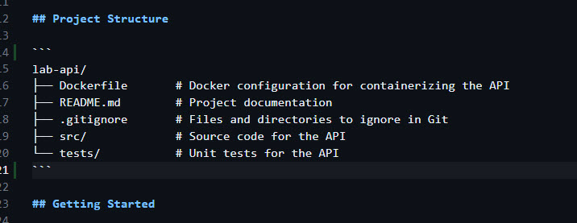
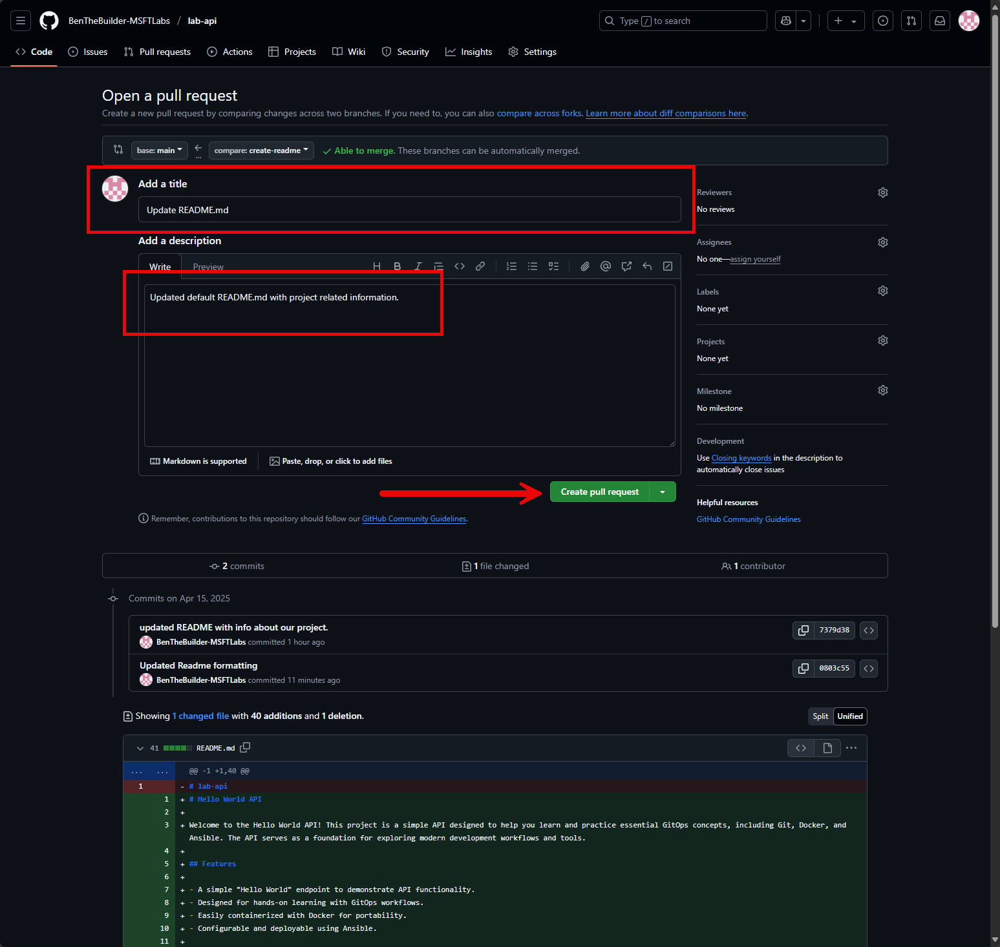
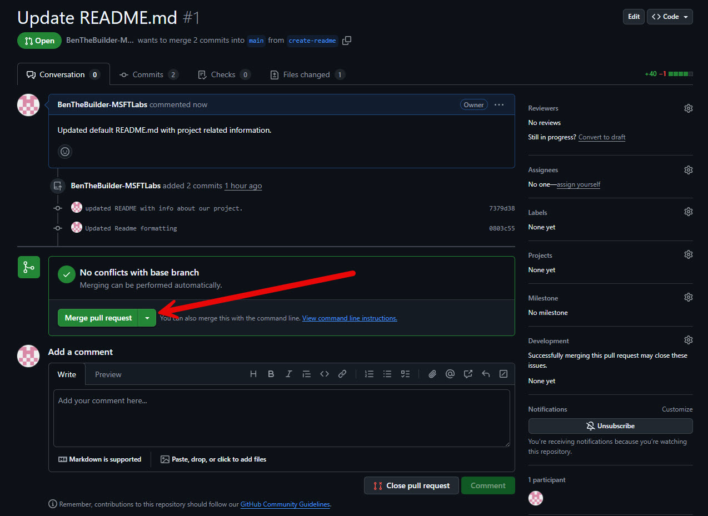
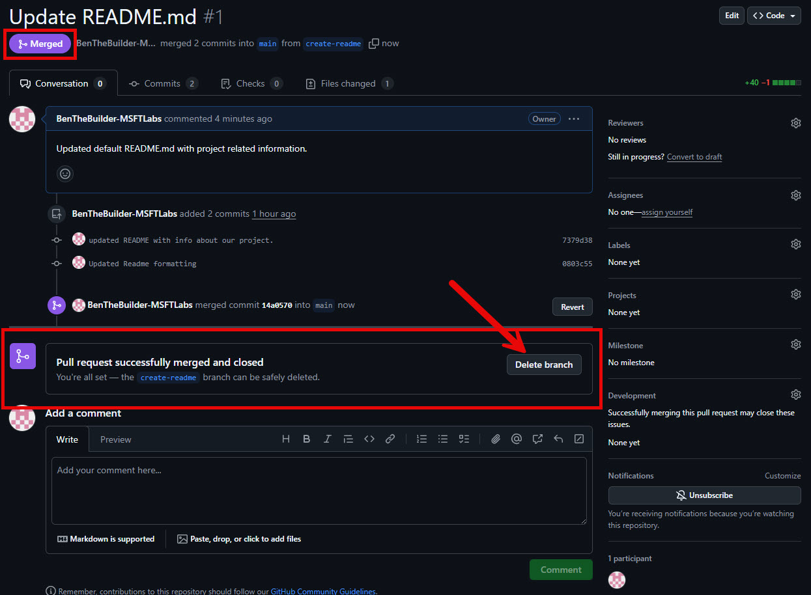
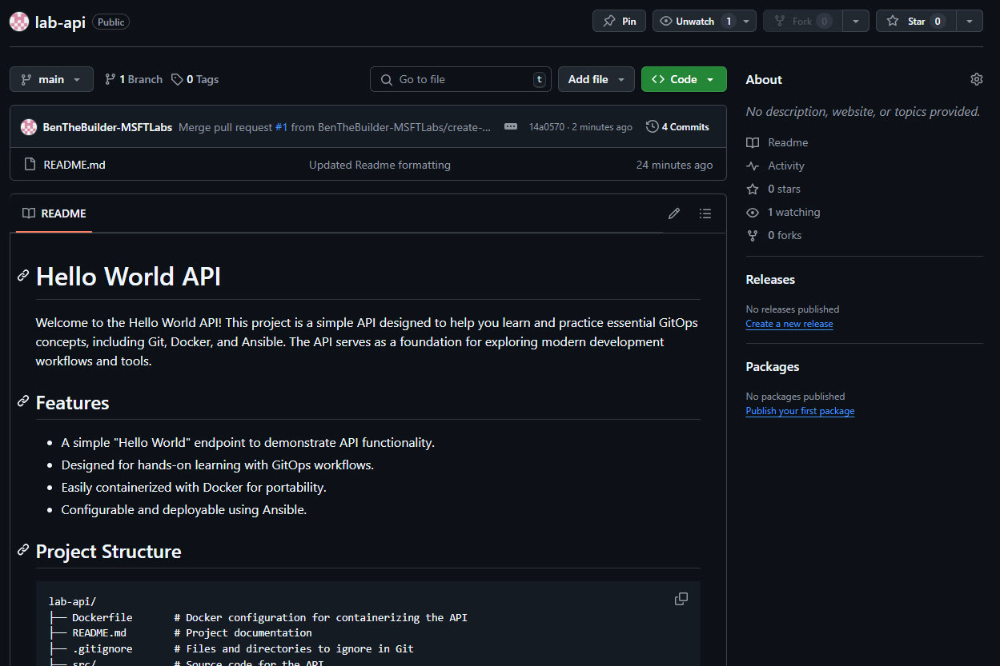

# Lab Guide #

## Fix README ##

1. Let's open our READMEmd file once again and scroll down to ```line 14``` and add ``` before and after our Project Structure.
    

---

2. Now we need to stage and commit the fix before pushing to our Remote Repository. 
    
    ```sh
    git add README.md 
    ```

    ```sh
    git commit -m 'Updated README.md formatting'
    ```
    ```sh
    # OUTPUT:
    [create-readme 0803c55] Updated Readme formatting
    1 file changed, 2 insertions(+)
    ```
    ```sh
    git push
    ```
    ```sh
    # OUTPUT:
    Enumerating objects: 5, done.
    Counting objects: 100% (5/5), done.
    Delta compression using up to 2 threads
    Compressing objects: 100% (2/2), done.
    Writing objects: 100% (3/3), 311 bytes | 311.00 KiB/s, done.
    Total 3 (delta 1), reused 0 (delta 0), pack-reused 0 (from 0)
    remote: Resolving deltas: 100% (1/1), completed with 1 local object.
    To https://github.com/BenTheBuilder-MSFTLabs/lab-api
    7379d38..0803c55  create-readme -> create-readme
    ```

---

3. We can verify everything looks good by checking ```git status```. 

    ```sh
    git status
    ```
    ```sh
    # OUTPUT:
    @BenTheBuilder-MSFTLabs ➜ /workspaces/lab-api (create-readme) $ git status
    On branch create-readme
    Your branch is up to date with 'origin/create-readme'.

    nothing to commit, working tree clean
    ```

---

4. Change back to ```main``` branch in preperation for next steps. 
    ```sh
    git checkout main
    ```
    ```sh
    # OUTPUT: 
    @BenTheBuilder-MSFTLabs ➜ /workspaces/lab-api (create-readme) $ git checkout main
    Switched to branch 'main'
    Your branch is up to date with 'origin/main'.
    ```

## Create Pull Request for Changes

1.  Let's go back to Github and navigate back to ```create-readme``` branch once more. You'll see that we are now ```2``` commits ahead of ```main```. On this screen we are going to click *Compare & pull request* button. 
    

---

2. In the 'Open a pull request' section, update Title and Description to match below. Then hit the "Create pull request" button indicated by the arrow. 
    

> [!NOTE]
>
> Take a few moments to explore this page before proceeding. 

---

3. Let's Merge our new pull request into ```main``` by hitting *Merge pull request* button. 
    

    Next you'll be prompted for a commit message. Just leave it as is and hit ```confirm merge```.
    

    After the merge completes. You'll see the following. Notice that the status is now *MERGED*. We are done with our ```create-readme``` branch so it is safe to delete it using the ```delete branch``` button. 
    

4. After we finish with the Pull Request process, lets hop back to the ```main``` branch page. 
    

    >OUTPUT: <br>
    > The README now shows the updated information under ```main```. <br>
    > And there are no flags at the top indicating ```main``` is behind on any commits. 

## Clean up Local ##

1. if you hop back to your terminal. You'll notice that READMEmd in the ```main``` branch doesn't have our updates..  This is because we need to PULL the chages down from our Remote Source. 
    ```sh
    git pull
    ```
    ```sh
    # OUTPUT:
    @BenTheBuilder-MSFTLabs ➜ /workspaces/lab-api (main) $ git pull
    remote: Enumerating objects: 1, done.
    remote: Counting objects: 100% (1/1), done.
    remote: Total 1 (delta 0), reused 0 (delta 0), pack-reused 0 (from 0)
    Unpacking objects: 100% (1/1), 908 bytes | 908.00 KiB/s, done.
    From https://github.com/BenTheBuilder-MSFTLabs/lab-api
    ba90a20..14a0570  main       -> origin/main
    Updating ba90a20..14a0570
    Fast-forward
    README.md | 41 ++++++++++++++++++++++++++++++++++++++++-
    1 file changed, 40 insertions(+), 1 deletion(-)
    @BenTheBuilder-MSFTLabs ➜ /workspaces/lab-api (main) $ 
    ```

    > [!NOTE]
    >
    > Make sure you are in the correct branch when doing ```git pull```. If you are not in ```main``` then you need to swich using ```git checkout main```.

---

2.  If you run ```git branch``` you'll see that the ```create-readme``` branch still exists locally. The * indicates the current active branch in the list. 
    ```sh
    git branch
    ```
    ```sh
    # OUTPUT: 
    @BenTheBuilder-MSFTLabs ➜ /workspaces/lab-api (main) $ git branch
    create-readme
    * main
    @BenTheBuilder-MSFTLabs ➜ /workspaces/lab-api (main) $ 
    ```

    Since we are done with it, we need to remove it from our local environment using git branch -d create-readme``` command. 
    ```sh
    git branch -d create-readme
    ```
    ```sh
    # OUTPUT: 
    @BenTheBuilder-MSFTLabs ➜ /workspaces/lab-api (main) $ git branch -d create-readme
    Deleted branch create-readme (was 0803c55).
    @BenTheBuilder-MSFTLabs ➜ /workspaces/lab-api (main) $ 
    ```

    If we run ```git branch``` again we can confirm that ```create-readem``` branch is gone. 
    ```sh
    # OUTPUT:
    @BenTheBuilder-MSFTLabs ➜ /workspaces/lab-api (main) $ git branch
    * main
    @BenTheBuilder-MSFTLabs ➜ /workspaces/lab-api (main) $ 
    ```
---
# End of Lab 01

[⬅ Back to LABGUIDE](LABGUIDE.md) 