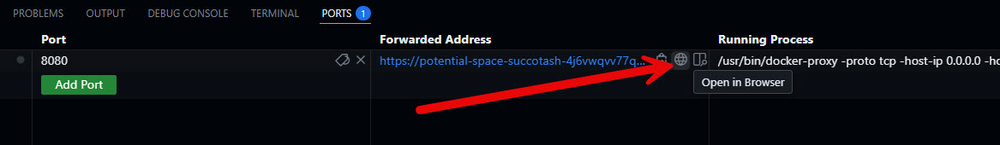
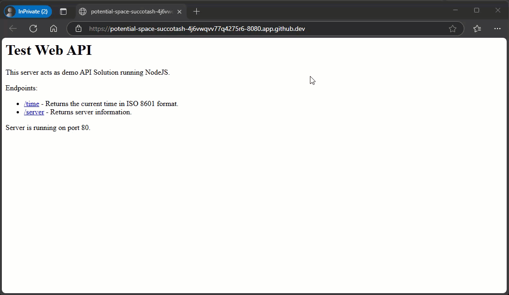

# Lab Guide #

This lab will focus on using the custom web-api image we created in the previous lab to test out by running a container locally. After testing is completed we'll push the custom image to Github Container Registry. 

### Run our custom image locally ###

This step focuses on testing the custom Docker image locally by running it as a container. First, you verify the image exists using docker images. Then, you deploy the container using docker run, mapping the container's port to your local machine for access. This allows you to interact with the application through a browser or API client to ensure it works as expected. Once testing is complete, you clean up the environment by stopping and removing the container and image.

1. Let's get a list of our docker images: 
    ```sh
    docker images
    ```
    ```sh
    # TERMINAL OUTPUT
    @BenTheBuilder-MSFTLabs ➜ /workspaces/lab-api (main) $ docker images
    REPOSITORY   TAG       IMAGE ID       CREATED          SIZE
    demo-api     latest    342167ae5aca   18 minutes ago   1.1GB
    ```
---
2. Now let's deploy our image. 
    ```sh
    docker run -d -p 8080:80 --name demo-webapi demo-api
    ```
    ```sh
    # TERMINAL OUTPUT:
    @BenTheBuilder-MSFTLabs ➜ /workspaces/lab-api (main) $ docker run -d -p 8080:80 --name demo-webapi demo-api
    100dfa99032bb5ca1782a3080d5d05645e55e2b55f6b9f06b16c99ca8a1bf0ff
    ```
    > Explanation:<br>
    > ```-d```: Runs the container in detached mode (in the background).<br>
    > ```-p 8080:80```: Maps port 8080 on your local machine to port 80 in the container.<br>
    > ```--name demo-webapi```: Assigns a name to the container for easier management.<br>
    > ```demo-api```: Specifies the image to use for the container.<br>
    ><br>
    > You can access the application at http://localhost:8080 in your browser or API client.

    When you execute the ```docker run``` command Github will prompt you to "Open in Browser". Click that button to launch a new Browser Window. 

    
    <br>
    If you close the popup or need to open the app again. You can open it from the ```ports``` tab next to Terminal. Then you click the little sphere icon.  
    <br>
    
---
3.  Now the app should be running in the browser. Let's test it out. 
    - Try hitting the various endpoints: ```/time``` and ```/server```
    
---
4. Now that we've tested everything. Let's stop the container so we can clean up our local environment. 
    1. First we need to stop the container: ```docker stop```
        ```sh
        docker stop demo-webapi
        ```
        ```sh
        # TERMINAL OUTPUT:
        @BenTheBuilder-MSFTLabs ➜ /workspaces/lab-api (main) $ docker stop demo-webapi 
        demo-webapi
        ```
    2. Now we can remove the container: ```docker rm```
        ```sh
        docker rm demo-webapi 
        ```
        ```sh
        # TERMINAL OUTPUT:  
        @BenTheBuilder-MSFTLabs ➜ /workspaces/lab-api (main) $ docker rm demo-webapi 
        demo-webapi
        ```
---   

### Deploy custom image to GitHub Container Registy ###

The next step involves pushing the custom Docker image to the GitHub Container Registry. This allows the image to be stored in a centralized location, making it accessible for deployment across different environments or sharing with collaborators. By pushing the image to the registry, you ensure it is versioned, secure, and ready for use in CI/CD pipelines or other workflows.

1. Tag the Image: The docker tag command assigns a new name to the existing image, including the registry URL (ghcr.io/<ghusername>/demo-api:latest). This step ensures the image is correctly identified for the target registry. Now we need to use ```docker tag``` to tag the image with the correct repository name and latest tag. 
    ```sh
    docker tag demo-api:latest ghcr.io/benthebuilder-msftlabs/demo-api:latest

    ## We can verify the version is created
    docker images
    ```
    ```sh
    # TERMINAL OUTPUT:
    @BenTheBuilder-MSFTLabs ➜ /workspaces/lab-api (main) $ docker tag demo-api:latest ghcr.io/benthebuilder-msftlabs/demo-api:latest
    @BenTheBuilder-MSFTLabs ➜ /workspaces/lab-api (main) $ docker images
    REPOSITORY                                TAG       IMAGE ID       CREATED             SIZE
    ghcr.io/benthebuilder-msftlabs/demo-api   latest    342167ae5aca   About an hour ago   1.1GB
    demo-api                                  latest    342167ae5aca   About an hour ago   1.1GB
    ```
---
2. Next we need to authenticate to GitHub Container Registry: The docker login command authenticates your Docker CLI with the GitHub Container Registry (ghcr.io) using your GitHub token. This step is necessary to push images to the registry securely.
    ```sh
    echo $GITHUB_TOKEN | docker login ghcr.io -u BenTheBuilder-MSFTLabs --password-stdin
    ```
    ```sh
    # TERMINAL OUTPUT: 
    @BenTheBuilder-MSFTLabs ➜ /workspaces/lab-api (main) $ echo $GITHUB_TOKEN | docker login ghcr.io -u BenTheBuilder-MSFTLabs --password-stdin

    WARNING! Your credentials are stored unencrypted in '/home/vscode/.docker/config.json'.
    Configure a credential helper to remove this warning. See
    https://docs.docker.com/go/credential-store/

    Login Succeeded
    ```
---
3. Finally, We Push the Image: The ```docker push``` command uploads the tagged image to the GitHub Container Registry. This step makes the image available in a centralized location for sharing, deployment, or CI/CD workflows.
    ```sh
    docker push ghcr.io/benthebuilder-msftlabs/demo-api:latest
    ```
    ```sh
    # TERMINAL OUTPUT:
    @BenTheBuilder-MSFTLabs ➜ /workspaces/lab-api (main) $ docker push ghcr.io/benthebuilder-msftlabs/demo-api:latest
    The push refers to repository [ghcr.io/benthebuilder-msftlabs/demo-api]
    c1d2563fb0b0: Pushed 
    11b31ac7717e: Pushed 
    80a8ae235490: Pushed 
    ec7f8dca8155: Mounted from benthebuilder-msftlabs/webapi 
    46dec0992c2d: Mounted from benthebuilder-msftlabs/webapi 
    659ae354f8ac: Mounted from benthebuilder-msftlabs/webapi 
    07f183d69b10: Mounted from benthebuilder-msftlabs/webapi 
    adab8b21d9fe: Mounted from benthebuilder-msftlabs/webapi 
    6c7c1b88da61: Mounted from benthebuilder-msftlabs/webapi 
    b2bcbd8ebb2b: Mounted from benthebuilder-msftlabs/webapi 
    7f0053786e6e: Mounted from benthebuilder-msftlabs/webapi 
    f7f2b929d8a5: Mounted from benthebuilder-msftlabs/webapi 
    latest: digest: sha256:4651dc52f9099028a6a84a570ff1e13856419a9ae32c616e9634e5f9c7e17ba8 size: 2836
    ```
---

### Push changes to repo ###

You know what to do.. ```git add```, ```git commit```, and then ```git push```. 
```sh
# Add all files to staging
git add .

# Commit staged files to repository
git commit -m 'push LAB2 work'

# Push to Github
git push
```
```sh
# TERMINAL OUTPUT
@BenTheBuilder-MSFTLabs ➜ /workspaces/lab-api (main) $ git add .

@BenTheBuilder-MSFTLabs ➜ /workspaces/lab-api (main) $ git commit -m 'push LAB2 work'
[main 6754967] push LAB2 work
 3 files changed, 48 insertions(+), 4 deletions(-)
 rename package.json => src/package.json (58%)
 create mode 100644 src/server.js
 
@BenTheBuilder-MSFTLabs ➜ /workspaces/lab-api (main) $ git push
Enumerating objects: 8, done.
Counting objects: 100% (8/8), done.
Delta compression using up to 2 threads
Compressing objects: 100% (6/6), done.
Writing objects: 100% (6/6), 1.17 KiB | 1.17 MiB/s, done.
Total 6 (delta 1), reused 0 (delta 0), pack-reused 0 (from 0)
remote: Resolving deltas: 100% (1/1), completed with 1 local object.
To https://github.com/BenTheBuilder-MSFTLabs/lab-api
   fc3ebf6..6754967  main -> main
```

Now lets add this image to our EnvVars/.bashrc so we can use it in later labs: 

```sh
echo "DOCKER_IMAGE='ghcr.io/benthebuilder-msftlabs/demo-api'" >> ~/.bashrc
```


# End of Lab 02
   
[⬅ Back to LABGUIDE](LABGUIDE.md) 
