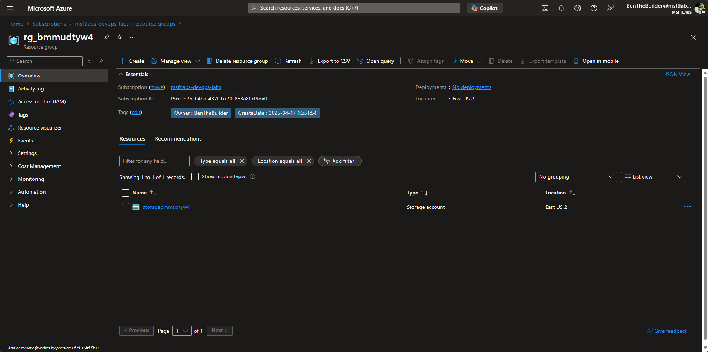

# Lab Guide #

This lab guides users through setting up Terraform in a workspace and configuring the necessary Azure infrastructure. It begins by validating the installation of Az CLI and Terraform, followed by creating a directory structure for infrastructure code. Users then generate a random string stored as an environment variable for resource naming. The lab demonstrates creating an Azure Resource Group and Storage Account using Az CLI, appending the random string for uniqueness. Finally, it assigns the Storage Blob Data Contributor role to the user at the resource group scope, ensuring proper permissions for managing storage resources.

### Getting Setup ###

This step in the lab ensures that the necessary tools are installed and configured for the environment. It begins by validating the installation of the Azure CLI (az) and Terraform, confirming their versions to ensure compatibility. Users then log in to Azure using the CLI and verify their account details to confirm access to the correct subscription and tenant. These steps establish the foundational setup required for subsequent infrastructure provisioning tasks.

1. Validate AzCLI is installed:
    ```sh
    az --version
    ```
    ```sh
    # TERMINAL OUTPUT: 
    @BenTheBuilder-MSFTLabs ➜ /workspaces/msft-intro-to-gitops (main) $ az --version
    azure-cli                         2.71.0

    core                              2.71.0
    telemetry                          1.1.0

    Dependencies:
    msal                            1.31.2b1
    azure-mgmt-resource               23.1.1

    Python location '/opt/az/bin/python3'
    Config directory '/home/vscode/.azure'
    Extensions directory '/home/vscode/.azure/cliextensions'

    Python (Linux) 3.12.8 (main, Mar 25 2025, 10:55:57) [GCC 10.2.1 20210110]

    Legal docs and information: aka.ms/AzureCliLegal


    Your CLI is up-to-date.
    ```
    > **NOTE**  
    > Output may be different as software is updated on build. So long as you see output you are good to move forward. 

--- 

2. Login to Az Cli:
    ```sh
    az login
    ```
   

    > **NOTE**  
    > Your list of Subscriptions will be different and depend on your access to your tenant. If you have multiple tenants you can use the ```--tenant``` parameter like this: ```az login --tenant 00000000-0000-0000-0000-000000000000```   
    > https://learn.microsoft.com/en-us/cli/azure/authenticate-azure-cli-interactively

---

3. Verify account information using ```az account show```. This will return information about your current active profile in Az CLI. 
    ```sh
    az account show
    ```
    ```sh
    # TERMINAL OUTPUT:
    @BenTheBuilder-MSFTLabs ➜ /workspaces/msft-intro-to-gitops (main) $ az account show
    {
    "environmentName": "AzureCloud",
    "homeTenantId": "00000000-0000-0000-0000-000000000000",
    "id": "00000000-0000-0000-0000-000000000000",
    "isDefault": true,
    "managedByTenants": [
        {
        "tenantId": "00000000-0000-0000-0000-000000000000"
        }
    ],
    "name": "msftlabs-devops-labs",
    "state": "Enabled",
    "tenantDefaultDomain": "msftlabs.org",
    "tenantDisplayName": "MSFTLABS",
    "tenantId": "00000000-0000-0000-0000-000000000000",
    "user": {
        "name": "BenTheBuilder@msftlabs.org",
        "type": "user"
        }
    }
    ```
---

4. Verify Terraform is installed and verify current version:
    ```sh
    terraform --version
    ```
    ```sh
    # TERMINAL OUTPUT:
    @BenTheBuilder-MSFTLabs ➜ /workspaces/msft-intro-to-gitops (main) $ terraform --version
    Terraform v1.11.4
    on linux_amd64
    ```
---

5. Create Ansible SSH Key that will be passed to the Virtual Machines for Ansible to authenticate with. As per best practices, each solution and environment should have their own keys defined to avoid accidental depoloyments to the wrong environment (ie Production)..

Create ```.ssh``` Directory for our keys: 
```sh
mkdir ~/.ssh
```

cd to ```.ssh``` directory and run keygen:
```sh
ssh-keygen -t rsa -b 4096 -f ~/.ssh/ansible -C "ansible-key"
```
```sh
# TERMINAL OUTPUT
@BenTheBuilder-MSFTLabs ➜ /workspaces/lab-api/infra/terraform (main) $ ssh-keygen -t rsa -b 4096 -f ~/.ssh/ansible -C "ansible-key"
Generating public/private rsa key pair.
Enter passphrase (empty for no passphrase): 
Enter same passphrase again: 
Your identification has been saved in /home/vscode/.ssh/ansible
Your public key has been saved in /home/vscode/.ssh/ansible.pub
The key fingerprint is:
SHA256:b3WrZA0Tq4YrqZy6LgDy07hfihD47MzXiX7RM7au/3U ansible-key
The key's randomart image is:
+---[RSA 4096]----+
|                 |
|                 |
|            .    |
|+            o   |
|=. o   .S   = .  |
|.++ . . =o o = . |
|o oo o.=.+= + E  |
|.=.oo+* .+ + o   |
| oO*Bo.=+.. .    |
+----[SHA256]-----+
```
>**NOTE**
> When prompted for passphrase simply press enter and leave them blank.

Now configure the require permsissions on the ```.ssh``` directory 
```sh
chmod 700 ~/.ssh
```

Set Permissons on private key:
```sh
chmod 600 ~/.ssh/ansible
```

Set permissions on public key file
```sh
chmod 644 ~/.ssh/ansible.pub
```

Finally verify the permissions are correct:
```sh
ls -ld ~/.ssh ~/.ssh/ansible ~/.ssh/ansible.pub
```
```sh
# TERMINAL OUTPUT:
@BenTheBuilder-MSFTLabs ➜ /workspaces/lab-api/infra/terraform (main) $ ls -ld ~/.ssh ~/.ssh/ansible ~/.ssh/ansible.pub
drwx------ 2 vscode vscode 4096 Apr 21 17:20 /home/vscode/.ssh
-rw------- 1 vscode vscode 3381 Apr 21 17:20 /home/vscode/.ssh/ansible
-rw-r--r-- 1 vscode vscode  737 Apr 21 17:20 /home/vscode/.ssh/ansible.pub
```


### Setup Directory Structure for Infra Code ###

This step in the lab focuses on setting up the directory structure for infrastructure code. It begins by ensuring the user is in the correct repository directory. A .gitignore file is created and populated with rules to exclude sensitive or unnecessary files for Terraform and Ansible. Finally, directories for Terraform and Ansible are created under a root infra folder, establishing a clean and organized structure for managing infrastructure as code.


1. Make sure you are in your ```lab-api``` repo directory. 
    ```sh
    cd /workspaces/lab-api
    ```

---

2. Create ```.gitignore``` for Terraform and Ansible to make sure we don't stage or commit things we shouldn't. 
    ```sh
    touch .gitignore
    ```

    Copy the folloing content into your ```.gitignore``` file:
    ```txt
    # Terraform
    infra/terraform/*.tfstate
    infra/terraform/*.tfstate.*
    infra/terraform/*.tfvars
    infra/terraform/*.tfplan
    infra/terraform/*.tfvars.json
    infra/terraform/.terraform/
    infra/terraform/.terraform.lock.hcl
    infra/terraform/crash.log
    infra/terraform/override.tf
    infra/terraform/override.tf.json
    infra/terraform/*_override.tf
    infra/terraform/*_override.tf.json

    # Ansible
    infra/ansible/*.retry
    infra/ansible/*.log
    infra/ansible/*.vault
    infra/ansible/*.cfg
    infra/ansible/*.tmp
    infra/ansible/*.bak
    infra/ansible/*.swp
    infra/ansible/.cache/
    infra/ansible/__pycache__/
    ```

---
3. Create infra directory for terraform and ansible. 
   Make root Infra Folder
   ```sh
    mkdir infra
    ```
    
    Create Terraform Folder
    ```sh
    mkdir infra/terraform
    ```
    
    Create Ansible Folder
    ```sh
    mkdir infra/ansible
    ```
    ```sh
    # REPO DIRECTORY STRUCTURE
    .
    ├── Dockerfile
    ├── .gitignore
    ├── infra
    │   ├── ansible
    │   └── terraform
    ├── README.md
    └── src
        ├── package.json
        └── server.js
    ```
---

### Create Random String for IaC reuse###

This step in the lab focuses on generating a random string and storing it as an environment variable in the .bashrc file for reuse in Infrastructure as Code (IaC). The random string, limited to 6 lowercase alphanumeric characters, ensures unique naming for resources to avoid conflicts during the lab. After adding the variable to .bashrc, users reload the file to make the variable available in the current session and validate its value. This setup helps enforce consistent and unique resource naming across the lab.

1. Create Random String and store it as EnvVar inside your ```.bashrc``` or bash profile file.. This ```RANDOM_STRING``` will be passed into your IaC as variable for appending to other resources to enforce that each has unique name and not conflict during lab. 
    ```sh
    echo "export RANDOM_STRING=$(head /dev/urandom | tr -dc a-z0-9 | head -c 6)" >> ~/.bashrc
    ```
    > **NOTE**  
    > The above command reads random bytes from the system's random number generator, filters the output to include only lowercase letters and digits, limits the output to 6 characters, and stores the generated string in a variable inside the ```.bashrc``` for reuse.

    Test Variable:
    ```sh
    echo $RANDOM_STRING
    ```
    ```sh
    # TERMINAL OUTPUT:
    @BenTheBuilder-MSFTLabs ➜ /workspaces/lab-api (main) $ echo "export RANDOM_STRING=$(head /dev/urandom | tr -dc a-z0-9 | head -c 6)" >> ~/.bashrc
    @BenTheBuilder-MSFTLabs ➜ /workspaces/lab-api (main) $ echo $RANDOM_STRING

    @BenTheBuilder-MSFTLabs ➜ /workspaces/lab-api (main) $ tail -n 2 ~/.bashrc
    GITHUB_TOKEN=$CONFIG_GITHUB_TOKEN
    export RANDOM_STRING=udtyw4
    @BenTheBuilder-MSFTLabs ➜ /workspaces/lab-api (main) $
    ```
    > **NOTE**  
    > Notice that the Variable isn't populating even though we can see it in the ```.bashrc```. This is because while it is stored in the ```.bashrc``` it won't be available until we reload that file. 

    Reload ```.bashrc``` after creating ```RANDOM_STRING``` so that it is available for use. 
    ```sh
    source ~/.bashrc
    ```
    
    Now let's validate the EnvVar is available for use:
    ```sh
    echo $RANDOM_STRING
    ```
    ```sh
    # TERMINAL OUTPUT
    @BenTheBuilder-MSFTLabs ➜ /workspaces/lab-api (main) $ source ~/.bashrc
    @BenTheBuilder-MSFTLabs ➜ /workspaces/lab-api (main) $ echo $RANDOM_STRING
    udtyw4
    @BenTheBuilder-MSFTLabs ➜ /workspaces/lab-api (main) $ 
    ```
---

### Create Resource Group and Statefile Storage Account ###

This step in the lab demonstrates how to use AzCLI to create an Azure Resource Group and a Storage Account for managing Terraform state files and other Infrastructure as Code (IaC) artifacts. The Resource Group name is appended with a random string to ensure uniqueness, and it is tagged with metadata such as the owner and creation date. A Storage Account is then created within the Resource Group with specific configurations. Finally, the user is assigned the Storage Blob Data Contributor role at the Resource Group scope to ensure proper permissions for managing storage resources.

1. Create Resource Group appending the value from ```$RANDOM_STRING``` to it. 
    ```sh
    az group create --name rg_bmm$RANDOM_STRING \
    --location eastus2 \
    --tags Owner=BenTheBuilder CreateDate="$(date '+%Y-%m-%d %H:%M:%S')"
    ```
    ```sh
    # TERMINAL OUTPUT:
    @BenTheBuilder-MSFTLabs ➜ /workspaces/lab-api (main) $ az group create --name rg_bmm$RANDOM_STRING \
    --location eastus2 \
    --tags Owner=BenTheBuilder CreateDate="$(date '+%Y-%m-%d %H:%M:%S')"
    {
    "id": "/subscriptions/f5cc0b2b-b4ba-437f-b770-863a80cf9da0/resourceGroups/rg_bmmudtyw4",
    "location": "eastus2",
    "managedBy": null,
    "name": "rg_bmmudtyw4",
    "properties": {
        "provisioningState": "Succeeded"
    },
    "tags": {
        "CreateDate": "2025-04-17 16:51:54",
        "Owner": "BenTheBuilder"
    },
    "type": "Microsoft.Resources/resourceGroups"
    }
    @BenTheBuilder-MSFTLabs ➜ /workspaces/lab-api (main) $ 
    ```
    > **NOTE**  
    > You can see the response includes provisioningState: "Succeeded" along with Configuration Settings used during provisioning.

---

2. Create Azure Storage Account to be used for IaC artifacts: 
    ```sh
    az storage account create --name strartifactsbmm$RANDOM_STRING \
    --resource-group rg_bmm$RANDOM_STRING \
    --location eastus2 \
    --sku Standard_LRS \
    --kind StorageV2 
    ```
    ```sh
    # TERMINAL OUTPUT
    @BenTheBuilder-MSFTLabs ➜ /workspaces/lab-api (main) $ az storage account create --name storagebmm$RANDOM_STRING \
    --resource-group rg_bmm$RANDOM_STRING \
    --location eastus2 \
    --sku Standard_LRS \
    --kind StorageV2
    {
    "accessTier": "Hot",
    "accountMigrationInProgress": null,
    "allowBlobPublicAccess": false,
    "allowCrossTenantReplication": false,
    "allowSharedKeyAccess": null,
    "allowedCopyScope": null,
    "azureFilesIdentityBasedAuthentication": null,
    "blobRestoreStatus": null,
    "creationTime": "2025-04-17T17:00:57.572355+00:00",
    "customDomain": null,
    ---- MORE ----
    "sku": {
        "name": "Standard_LRS",
        "tier": "Standard"
    },
    "statusOfPrimary": "available",
    "statusOfSecondary": null,
    "storageAccountSkuConversionStatus": null,
    "tags": {},
    "type": "Microsoft.Storage/storageAccounts"
    }
    @BenTheBuilder-MSFTLabs ➜ /workspaces/lab-api (main) $ 
    ```
    > **NOTE**  
    > The above output was shortened. But you'll see that alot of information is returned when you create different resource types using AzCLI. These are returned by the Azure Resource Provider APIs that AzCLI is calling during execution. These are the same APIs that Terraform calls during its ```terraform apply``` operations. 

    Lastly; you need to create a container for your Terraform State file:
    ```sh
    az storage container create \
    --name tfstate \
    --account-name strartifactsbmm$RANDOM_STRING \
    --auth-mode login
    ```
    ```sh
    # TERMINAL OUTPUT
    @BenTheBuilder-MSFTLabs ➜ /workspaces/lab-api (main) $  az storage container create \
    --name tfstate \
    --account-name strartifactsbmm$RANDOM_STRING \
    --auth-mode login
    {
    "created": true
    }
    ```

---
3. Give your UserIdentity the ```Storage Blob Data Contributor``` Role at the Resource Group Scope:
    ```sh
    az role assignment create \
    --assignee $(az account show --query user.name -o tsv) \
    --role "Storage Blob Data Contributor" \
    --scope $(az group show --name rg_bmm$RANDOM_STRING --query id -o tsv)
    ```
    ```sh
    # TERMINAL OUTPUT:
    @BenTheBuilder-MSFTLabs ➜ /workspaces/lab-api (main) $ az role assignment create \
    --assignee $(az account show --query user.name -o tsv) \
    --role "Storage Blob Data Contributor" \
    --scope $(az group show --name rg_bmm$RANDOM_STRING --query id -o tsv)
    {
    "condition": null,
    "conditionVersion": null,
    "createdBy": null,
    "createdOn": "2025-04-17T17:14:38.754157+00:00",
    "delegatedManagedIdentityResourceId": null,
    "description": null,
    "id": "/subscriptions/f5cc0b2b-b4ba-437f-b770-863a80cf9da0/resourceGroups/rg_bmmudtyw4/providers/Microsoft.Authorization/roleAssignments/3acfd617-6180-48d0-b276-ae01e8926ae3",
    "name": "3acfd617-6180-48d0-b276-ae01e8926ae3",
    "principalId": "d64e8d22-634c-4979-b44b-3e9197ded41e",
    "principalType": "User",
    "resourceGroup": "rg_bmmudtyw4",
    "roleDefinitionId": "/subscriptions/f5cc0b2b-b4ba-437f-b770-863a80cf9da0/providers/Microsoft.Authorization/roleDefinitions/ba92f5b4-2d11-453d-a403-e96b0029c9fe",
    "scope": "/subscriptions/f5cc0b2b-b4ba-437f-b770-863a80cf9da0/resourceGroups/rg_bmmudtyw4",
    "type": "Microsoft.Authorization/roleAssignments",
    "updatedBy": "d64e8d22-634c-4979-b44b-3e9197ded41e",
    "updatedOn": "2025-04-17T17:14:39.204165+00:00"
    }
    @BenTheBuilder-MSFTLabs ➜ /workspaces/lab-api (main) $ 
    ```
    
---
4. Now we can open a browser and view our newly created resources in the Azure Portal:
    
---

# End of Lab 
   
[⬅ Back to LABGUIDE](LABGUIDE.md) | [Next to LAB02 ➡](LAB02.md)
