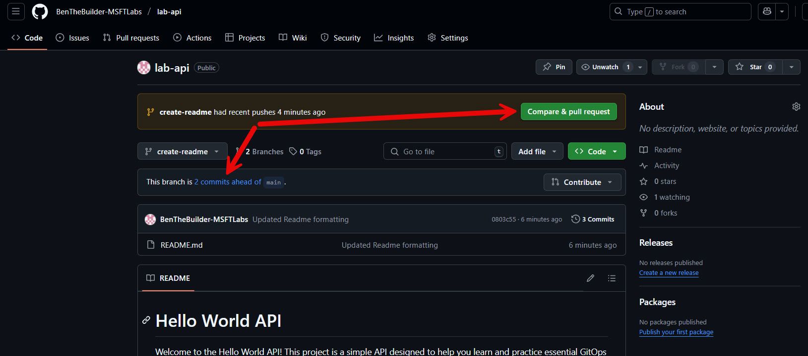
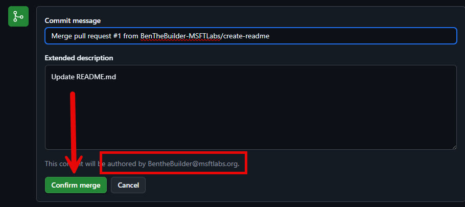

# Lab Guide #

## Fix README ##

In this step, you will fix the formatting issue in the README.md file by adding code block delimiters (three backticks) around the "Project Structure" section. This ensures the structure is displayed correctly in Markdown.

Start by opening the README.md file in your editor and scrolling to line 14. Add three backticks (```) before and after the "Project Structure" section to format it as a code block. Save the changes using Ctrl + S.

Next, stage the updated file using the git add README.md command. Commit the changes with a descriptive message using git commit -m 'Updated [README.md](http://_vscodecontentref_/2) formatting'. Finally, push the changes to the remote repository using git push. If everything is successful, you will see confirmation messages in the terminal.

Verify the changes by running git status. The output should indicate that your working tree is clean and the branch is up to date. Once confirmed, switch back to the main branch using git checkout main to prepare for the next steps. This ensures the formatting fix is properly applied and ready for further development.

1. Let's open our READMEmd file once again and scroll down to ```line 14``` and add ``` before and after our Project Structure. *(See below)*
    

    >**NOTE**  
    > These are three backticks (or grave accent) and not single qoutes/apostre's. 

---

2. Now we need to stage and commit the fix before pushing to our Remote Repository. 
    
    ```sh
    git add README.md 
    ```

    ```sh
    git commit -m 'Updated README.md formatting'
    ```
    ```sh
    # TERMINAL OUTPUT:
    [create-readme 0803c55] Updated Readme formatting
    1 file changed, 2 insertions(+)
    ```
    ```sh
    git push
    ```
    ```sh
    # TERMINAL OUTPUT:
    Enumerating objects: 5, done.
    Counting objects: 100% (5/5), done.
    Delta compression using up to 2 threads
    Compressing objects: 100% (2/2), done.
    Writing objects: 100% (3/3), 311 bytes | 311.00 KiB/s, done.
    Total 3 (delta 1), reused 0 (delta 0), pack-reused 0 (from 0)
    remote: Resolving deltas: 100% (1/1), completed with 1 local object.
    To https://github.com/BenTheBuilder-MSFTLabs/lab-api
    7379d38..0803c55  create-readme -> create-readme
    ```

---

3. We can verify everything looks good by checking ```git status```. 

    ```sh
    git status
    ```
    ```sh
    # TERMINAL OUTPUT:
    @BenTheBuilder-MSFTLabs ➜ /workspaces/lab-api (create-readme) $ git status
    On branch create-readme
    Your branch is up to date with 'origin/create-readme'.

    nothing to commit, working tree clean
    ```

---

4. Change back to ```main``` branch in preperation for next steps. 
    ```sh
    git checkout main
    ```
    ```sh
    # TERMINAL OUTPUT: 
    @BenTheBuilder-MSFTLabs ➜ /workspaces/lab-api (create-readme) $ git checkout main
    Switched to branch 'main'
    Your branch is up to date with 'origin/main'.
    ```

## Create Pull Request for Changes ##

In this step, you will create a pull request to merge the changes from the create-readme branch into the main branch. Start by navigating to the create-readme branch on GitHub. You will notice that it is now two commits ahead of main. Click the Compare & pull request button to begin the process.

In the "Open a pull request" section, update the title and description to clearly describe the changes being merged. Once done, click the "Create pull request" button. Take a moment to explore the pull request page to understand its features before proceeding.

Next, merge the pull request into the main branch by clicking the Merge pull request button. When prompted for a commit message, leave it as is and click Confirm merge. After the merge is complete, the status will update to MERGED. Since the create-readme branch is no longer needed, delete it by clicking the Delete branch button.

Finally, navigate back to the main branch page to verify the changes. The updated README.md should now be visible under the main branch, with no flags indicating that main is behind on any commits. This completes the pull request process and ensures your changes are successfully merged.

1.  Let's go back to Github and navigate back to ```create-readme``` branch once more. You'll see that we are now ```2``` commits ahead of ```main```. On this screen we are going to click *Compare & pull request* button. 
    

---

2. In the 'Open a pull request' section, update Title and Description to match below. Then hit the "Create pull request" button indicated by the arrow. 
    

    > **NOTE**  
    > Take a few moments to explore this page before proceeding. 

---

3. Let's Merge our new pull request into ```main``` by hitting *Merge pull request* button. 
    

    Next you'll be prompted for a commit message. Just leave it as is and hit ```confirm merge```.
    

    After the merge completes. You'll see the following. Notice that the status is now *MERGED*. We are done with our ```create-readme``` branch so it is safe to delete it using the ```delete branch``` button. 
    

4. After we finish with the Pull Request process, lets hop back to the ```main``` branch page. 
    

    > TERMINAL OUTPUT: <br>
    > The README now shows the updated information under ```main```. <br>
    > And there are no flags at the top indicating ```main``` is behind on any commits. 

## Clean up Local ##

In this step, you will clean up your local environment by pulling the latest changes from the remote repository and removing the create-readme branch locally.

Start by ensuring you are on the main branch. If not, switch to it using git checkout main. Then, pull the latest changes from the remote repository using the git pull command. This will update your local main branch with the changes merged from the create-readme branch.

Next, check your local branches using the git branch command. You will notice that the create-readme branch still exists locally. Since it is no longer needed, delete it using the git branch -d create-readme command. Verify the branch has been removed by running git branch again, which should now only list the main branch.

This process ensures your local environment is clean and up to date with the remote repository.

1. if you hop back to your terminal. You'll notice that READMEmd in the ```main``` branch doesn't have our updates..  This is because we need to PULL the chages down from our Remote Source. 
    ```sh
    git pull
    ```
    ```sh
    # TERMINAL OUTPUT:
    @BenTheBuilder-MSFTLabs ➜ /workspaces/lab-api (main) $ git pull
    remote: Enumerating objects: 1, done.
    remote: Counting objects: 100% (1/1), done.
    remote: Total 1 (delta 0), reused 0 (delta 0), pack-reused 0 (from 0)
    Unpacking objects: 100% (1/1), 908 bytes | 908.00 KiB/s, done.
    From https://github.com/BenTheBuilder-MSFTLabs/lab-api
    ba90a20..14a0570  main       -> origin/main
    Updating ba90a20..14a0570
    Fast-forward
    README.md | 41 ++++++++++++++++++++++++++++++++++++++++-
    1 file changed, 40 insertions(+), 1 deletion(-)
    @BenTheBuilder-MSFTLabs ➜ /workspaces/lab-api (main) $ 
    ```

> **NOTE**  
> Make sure you are in the correct branch when doing ```git pull```. If you are not in ```main``` then you need to swich using ```git   checkout main```.

---

2.  If you run ```git branch``` you'll see that the ```create-readme``` branch still exists locally. The * indicates the current active branch in the list. 
    ```sh
    git branch
    ```
    ```sh
    # TERMINAL OUTPUT: 
    @BenTheBuilder-MSFTLabs ➜ /workspaces/lab-api (main) $ git branch
    create-readme
    * main
    @BenTheBuilder-MSFTLabs ➜ /workspaces/lab-api (main) $ 
    ```

    Since we are done with it, we need to remove it from our local environment using git branch -d create-readme``` command. 
    ```sh
    git branch -d create-readme
    ```
    ```sh
    # TERMINAL OUTPUT: 
    @BenTheBuilder-MSFTLabs ➜ /workspaces/lab-api (main) $ git branch -d create-readme
    Deleted branch create-readme (was 0803c55).
    @BenTheBuilder-MSFTLabs ➜ /workspaces/lab-api (main) $ 
    ```

    If we run ```git branch``` again we can confirm that ```create-readem``` branch is gone. 
    ```sh
    # TERMINAL OUTPUT:
    @BenTheBuilder-MSFTLabs ➜ /workspaces/lab-api (main) $ git branch
    * main
    @BenTheBuilder-MSFTLabs ➜ /workspaces/lab-api (main) $ 
    ```
---
# End of Lab 01

[⬅ Back to LABGUIDE](LABGUIDE.md) 