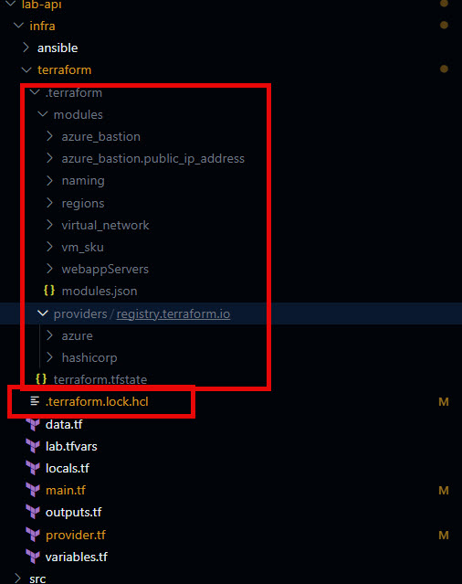
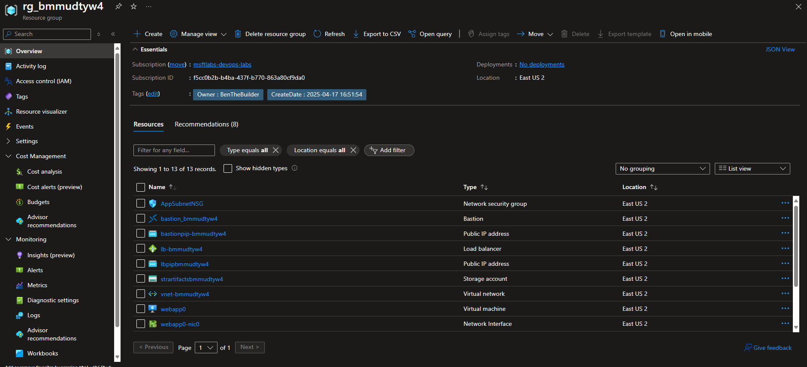

# Lab Guide #

This lab guides users through 

write a short paragraph that summarizes what this step in the lab is performing

## Terraform FMT ##

```terraform fmt``` is a command used to format Terraform configuration files according to the canonical style conventions defined by HashiCorp. It ensures that the code is clean, consistent, and easy to read, which is especially important when collaborating in teams or working on large infrastructure projects. The command scans the current directory (and optionally subdirectories) for ```.tf``` and ```.tfvars``` files and reformats them to align with standardized indentation, spacing, and alignment rules.

 This helps prevent syntax errors caused by misaligned code and improves maintainability by enforcing a uniform structure. Running ```terraform fmt``` is a best practice before committing code to version control, as it ensures that all team members adhere to the same formatting standards. To use it, simply run ```terraform fmt``` in the terminal from the root of your Terraform project. You can also use the ```-recursive``` flag to format files in nested directories. If any changes are made, the command will update the files in place, making it a quick and efficient way to maintain clean Terraform code.

-   Set current directory to your terraform:
    ```sh
    cd /workspaces/lab-api/infra/terraform
    ```

-   Now execute ```terraform fmt```:
    ```sh
    terraform fmt
    ```


    BEFORE:
    

    AFTER:
    


---

## Terraform Init ##

```terraform init``` is the first command that must be run when starting a new Terraform project or working with an existing one. It initializes the working directory by preparing the backend configuration and downloading the required provider plugins specified in the Terraform configuration files. The backend configuration determines where Terraform stores its state file, which is critical for tracking the infrastructure's current state. During initialization, Terraform also validates the configuration files and ensures that all dependencies, such as providers (e.g., azurerm for Azure or aws for AWS), are downloaded and installed in the ```.terraform``` directory. This step is essential for enabling Terraform to interact with the specified cloud providers or other APIs. Running ```terraform init``` is a prerequisite for executing other Terraform commands like ```plan``` or ```apply```. If the configuration changes, such as adding a new provider or modifying the backend, re-running terraform init ensures that the environment is updated accordingly.

>**NOTE**  
> This stage leverages the ```provider.tf``` and modules within the terraform templates to stage everything needed locally in the .terraform directory. This directory should _*NOT*_ be included in source control. It is recommended that you trash the .terraform directory, and run ```terraform init``` on each new deployment. 

Run the following command: 
```sh
terraform init
```
```sh
# TERMINAL OUTPUT:
@BenTheBuilder-MSFTLabs ➜ /workspaces/lab-api/infra/terraform (main) $ terraform init
Initializing the backend...

Successfully configured the backend "azurerm"! Terraform will automatically
use this backend unless the backend configuration changes.
Initializing modules...
Initializing provider plugins...
- Finding azure/azapi versions matching ">= 1.13.0, ~> 2.0, ~> 2.3.0, < 3.0.0"...
- Finding hashicorp/azurerm versions matching ">= 3.115.0, >= 3.116.0, ~> 4.10, ~> 4.25.0, < 5.0.0"...
- Finding hashicorp/random versions matching ">= 3.3.2, >= 3.5.0, ~> 3.5, ~> 3.6, ~> 3.7.0"...
- Finding azure/modtm versions matching "~> 0.3"...
- Finding hashicorp/local versions matching "~> 2.5"...
- Finding hashicorp/tls versions matching "~> 4.0"...
- Installing azure/azapi v2.3.0...
- Installed azure/azapi v2.3.0 (signed by a HashiCorp partner, key ID 6F0B91BDE98478CF)
- Installing hashicorp/azurerm v4.25.0...
- Installed hashicorp/azurerm v4.25.0 (signed by HashiCorp)
- Installing hashicorp/random v3.7.1...
- Installed hashicorp/random v3.7.1 (signed by HashiCorp)
- Installing azure/modtm v0.3.5...
- Installed azure/modtm v0.3.5 (signed by a HashiCorp partner, key ID 6F0B91BDE98478CF)
- Installing hashicorp/local v2.5.2...
- Installed hashicorp/local v2.5.2 (signed by HashiCorp)
- Installing hashicorp/tls v4.0.6...
- Installed hashicorp/tls v4.0.6 (signed by HashiCorp)
Partner and community providers are signed by their developers.
If you'd like to know more about provider signing, you can read about it here:
https://developer.hashicorp.com/terraform/cli/plugins/signing
Terraform has created a lock file .terraform.lock.hcl to record the provider
selections it made above. Include this file in your version control repository
so that Terraform can guarantee to make the same selections by default when
you run "terraform init" in the future.

Terraform has been successfully initialized!

You may now begin working with Terraform. Try running "terraform plan" to see
any changes that are required for your infrastructure. All Terraform commands
should now work.

If you ever set or change modules or backend configuration for Terraform,
rerun this command to reinitialize your working directory. If you forget, other
commands will detect it and remind you to do so if necessary.
@BenTheBuilder-MSFTLabs ➜ /workspaces/lab-api/infra/terraform (main) $ 
```

You'll see a new directory is created along with a new file called ```.terraform.lock.hcl```. 


>**NOTE**  
> The .terraform.lock.hcl file is an automatically generated file created by Terraform during the terraform init process. It is a dependency lock file that records the exact versions of the provider plugins used in your Terraform configuration. This ensures consistency and reproducibility across different environments or team members working on the same project. By locking the provider versions, it prevents unexpected changes or compatibility issues that could arise from using newer or incompatible versions of providers.  

>The file includes:  
>- The provider names and their exact versions.
>- Checksums to verify the integrity of the downloaded plugins.
>- Metadata about the providers, such as their source and signing information.
>- It is recommended to include the .terraform.lock.hcl file in version control (e.g., Git) so that all team members and CI/CD pipelines use the same provider versions, ensuring consistent behavior across deployments.

---

## Terraform Plan ##

The ```terraform plan``` command is a critical step in the Terraform workflow, as it allows users to preview the changes that Terraform will make to the infrastructure before applying them. When executed with the ```--var-file``` flag, such as terraform plan ```--var-file=lab.tfvars```, Terraform uses the specified variable file (lab.tfvars) to supply input values for the configuration. This ensures that the plan reflects the desired state based on the provided variables.

 The ```--out``` flag, as in ```--out lab.tfplan```, saves the generated execution plan to a file (lab.tfplan) for later use, ensuring that the exact plan can be applied without re-evaluating the configuration. This is particularly useful in collaborative environments or CI/CD pipelines where consistency is critical. The terraform plan command validates the configuration, checks for syntax errors, and calculates the actions required to align the current state of the infrastructure with the desired state defined in the configuration files. It outputs a detailed summary of the proposed changes, including resources to be created, updated, or destroyed, enabling users to review and confirm the changes before proceeding with terraform apply. This step minimizes the risk of unintended modifications and ensures a controlled and predictable infrastructure deployment process.

>**IMPORTANT**  
> The ```.tfplan``` contains sensative information and must be stored in a secure location between execution stages. It is safe to recreate the ```.tfplan``` in subsequent executions vs reusing the same one. 

>**INFO**  
> Take a minute to review the output from this command. The last few lines are especially worth noting. It outlines how many reswources are to be created (33), Changed, or Destroyed. It also gives you a preview what the ```output```will give you. 
```sh
Plan: 33 to add, 0 to change, 0 to destroy.

Changes to Outputs:
  + AzureRegion       = "eastus2"
  + BastionName       = "bastion_bmmudtyw4"
  + ResourceGroupName = "rg_bmmudtyw4"
  + lb_public_ip      = (known after apply)
  + vm_private_ips    = [
      + (known after apply),
      + (known after apply),
    ]
  + vm_resourceId     = [
      + (known after apply),
      + (known after apply),
    ]
```


Execute the ```terraform plan``` command:
```sh
terraform plan --var-file=lab.tfvars --out lab.tfplan
```
```sh
# TERMINAL OUTPUT:
@BenTheBuilder-MSFTLabs ➜ /workspaces/lab-api/infra/terraform (main) $ terraform plan --var-file=lab.tfvars --out lab.tfplan
Acquiring state lock. This may take a few moments...
module.virtual_network.data.modtm_module_source.telemetry[0]: Reading...
module.vm_sku.data.modtm_module_source.telemetry[0]: Reading...
module.webappServers[0].data.modtm_module_source.telemetry[0]: Reading...
module.webappServers[1].data.modtm_module_source.telemetry[0]: Reading...
module.regions.data.modtm_module_source.telemetry[0]: Reading...
module.virtual_network.data.modtm_module_source.telemetry[0]: Read complete after 0s
module.vm_sku.data.modtm_module_source.telemetry[0]: Read complete after 0s
module.webappServers[1].data.modtm_module_source.telemetry[0]: Read complete after 0s
module.webappServers[0].data.modtm_module_source.telemetry[0]: Read complete after 0s
module.regions.data.modtm_module_source.telemetry[0]: Read complete after 0s
module.regions.data.azapi_client_config.current: Reading...
module.regions.data.azapi_client_config.telemetry[0]: Reading...
module.regions.data.azapi_client_config.current: Read complete after 2s [id=clientConfigs/subscriptionId=f5cc0b2b-b4ba-437f-b770-863a80cf9da0;tenantId=477bacc4-4ada-4431-940b-b91cf6cb3fd4]
module.regions.data.azapi_client_config.telemetry[0]: Read complete after 2s [id=clientConfigs/subscriptionId=f5cc0b2b-b4ba-437f-b770-863a80cf9da0;tenantId=477bacc4-4ada-4431-940b-b91cf6cb3fd4]
module.vm_sku.data.azurerm_subscription.current: Reading...
module.webappServers[1].data.azurerm_client_config.telemetry[0]: Reading...
data.azurerm_resource_group.rg: Reading...
module.vm_sku.data.azurerm_client_config.telemetry[0]: Reading...
module.virtual_network.data.azurerm_client_config.this: Reading...
module.azure_bastion.data.azurerm_subscription.current: Reading...
data.azurerm_client_config.current: Reading...
module.webappServers[1].data.azurerm_client_config.telemetry[0]: Read complete after 0s [id=Y2xpZW50Q29uZmlncy9jbGllbnRJZD0wNGIwNzc5NS04ZGRiLTQ2MWEtYmJlZS0wMmY5ZTFiZjdiNDY7b2JqZWN0SWQ9ZDY0ZThkMjItNjM0Yy00OTc5LWI0NGItM2U5MTk3ZGVkNDFlO3N1YnNjcmlwdGlvbklkPWY1Y2MwYjJiLWI0YmEtNDM3Zi1iNzcwLTg2M2E4MGNmOWRhMDt0ZW5hbnRJZD00NzdiYWNjNC00YWRhLTQ0MzEtOTQwYi1iOTFjZjZjYjNmZDQ=]
module.webappServers[0].data.azurerm_client_config.telemetry[0]: Reading...
module.virtual_network.data.azurerm_client_config.telemetry[0]: Reading...
module.vm_sku.data.azurerm_client_config.telemetry[0]: Read complete after 0s [id=Y2xpZW50Q29uZmlncy9jbGllbnRJZD0wNGIwNzc5NS04ZGRiLTQ2MWEtYmJlZS0wMmY5ZTFiZjdiNDY7b2JqZWN0SWQ9ZDY0ZThkMjItNjM0Yy00OTc5LWI0NGItM2U5MTk3ZGVkNDFlO3N1YnNjcmlwdGlvbklkPWY1Y2MwYjJiLWI0YmEtNDM3Zi1iNzcwLTg2M2E4MGNmOWRhMDt0ZW5hbnRJZD00NzdiYWNjNC00YWRhLTQ0MzEtOTQwYi1iOTFjZjZjYjNmZDQ=]
module.webappServers[0].data.azurerm_client_config.telemetry[0]: Read complete after 0s [id=Y2xpZW50Q29uZmlncy9jbGllbnRJZD0wNGIwNzc5NS04ZGRiLTQ2MWEtYmJlZS0wMmY5ZTFiZjdiNDY7b2JqZWN0SWQ9ZDY0ZThkMjItNjM0Yy00OTc5LWI0NGItM2U5MTk3ZGVkNDFlO3N1YnNjcmlwdGlvbklkPWY1Y2MwYjJiLWI0YmEtNDM3Zi1iNzcwLTg2M2E4MGNmOWRhMDt0ZW5hbnRJZD00NzdiYWNjNC00YWRhLTQ0MzEtOTQwYi1iOTFjZjZjYjNmZDQ=]
module.virtual_network.data.azurerm_client_config.telemetry[0]: Read complete after 0s [id=Y2xpZW50Q29uZmlncy9jbGllbnRJZD0wNGIwNzc5NS04ZGRiLTQ2MWEtYmJlZS0wMmY5ZTFiZjdiNDY7b2JqZWN0SWQ9ZDY0ZThkMjItNjM0Yy00OTc5LWI0NGItM2U5MTk3ZGVkNDFlO3N1YnNjcmlwdGlvbklkPWY1Y2MwYjJiLWI0YmEtNDM3Zi1iNzcwLTg2M2E4MGNmOWRhMDt0ZW5hbnRJZD00NzdiYWNjNC00YWRhLTQ0MzEtOTQwYi1iOTFjZjZjYjNmZDQ=]
module.virtual_network.data.azurerm_client_config.this: Read complete after 0s [id=Y2xpZW50Q29uZmlncy9jbGllbnRJZD0wNGIwNzc5NS04ZGRiLTQ2MWEtYmJlZS0wMmY5ZTFiZjdiNDY7b2JqZWN0SWQ9ZDY0ZThkMjItNjM0Yy00OTc5LWI0NGItM2U5MTk3ZGVkNDFlO3N1YnNjcmlwdGlvbklkPWY1Y2MwYjJiLWI0YmEtNDM3Zi1iNzcwLTg2M2E4MGNmOWRhMDt0ZW5hbnRJZD00NzdiYWNjNC00YWRhLTQ0MzEtOTQwYi1iOTFjZjZjYjNmZDQ=]
data.azurerm_client_config.current: Read complete after 0s [id=Y2xpZW50Q29uZmlncy9jbGllbnRJZD0wNGIwNzc5NS04ZGRiLTQ2MWEtYmJlZS0wMmY5ZTFiZjdiNDY7b2JqZWN0SWQ9ZDY0ZThkMjItNjM0Yy00OTc5LWI0NGItM2U5MTk3ZGVkNDFlO3N1YnNjcmlwdGlvbklkPWY1Y2MwYjJiLWI0YmEtNDM3Zi1iNzcwLTg2M2E4MGNmOWRhMDt0ZW5hbnRJZD00NzdiYWNjNC00YWRhLTQ0MzEtOTQwYi1iOTFjZjZjYjNmZDQ=]
module.vm_sku.data.azurerm_subscription.current: Read complete after 0s [id=/subscriptions/f5cc0b2b-b4ba-437f-b770-863a80cf9da0]
data.azurerm_resource_group.rg: Read complete after 0s [id=/subscriptions/f5cc0b2b-b4ba-437f-b770-863a80cf9da0/resourceGroups/rg_bmmudtyw4]
module.azure_bastion.data.azurerm_subscription.current: Read complete after 0s [id=/subscriptions/f5cc0b2b-b4ba-437f-b770-863a80cf9da0]
module.vm_sku.data.azapi_resource_list.vm[0]: Reading...
module.vm_sku.data.azapi_resource_list.vm[0]: Read complete after 8s [id=/subscriptions/f5cc0b2b-b4ba-437f-b770-863a80cf9da0/providers/Microsoft.Compute/skus?$filter=location%20eq%20%27eastus2%27]

Terraform used the selected providers to generate the following execution plan. Resource actions are indicated with the following symbols:
  + create

Terraform will perform the following actions:

  # azurerm_lb.webapp_lb will be created
  + resource "azurerm_lb" "webapp_lb" {
      + id                   = (known after apply)
      + location             = "eastus2"
      + name                 = "lb-bmmudtyw4"
      + private_ip_address   = (known after apply)
      + private_ip_addresses = (known after apply)
      + resource_group_name  = "rg_bmmudtyw4"
      + sku                  = "Standard"
      + sku_tier             = "Regional"

      + frontend_ip_configuration {
          + gateway_load_balancer_frontend_ip_configuration_id = (known after apply)
          + id                                                 = (known after apply)
          + inbound_nat_rules                                  = (known after apply)
          + load_balancer_rules                                = (known after apply)
          + name                                               = "frontend-bmmudtyw4"
          + outbound_rules                                     = (known after apply)
          + private_ip_address                                 = (known after apply)
          + private_ip_address_allocation                      = (known after apply)
          + private_ip_address_version                         = (known after apply)
          + public_ip_address_id                               = (known after apply)
          + public_ip_prefix_id                                = (known after apply)
          + subnet_id                                          = (known after apply)
        }
    }

  # azurerm_lb_backend_address_pool.webapp_backend_pool will be created
  + resource "azurerm_lb_backend_address_pool" "webapp_backend_pool" {
      + backend_ip_configurations = (known after apply)
      + id                        = (known after apply)
      + inbound_nat_rules         = (known after apply)
      + load_balancing_rules      = (known after apply)
      + loadbalancer_id           = (known after apply)
      + name                      = "test-pool"
      + outbound_rules            = (known after apply)
    }

  # azurerm_lb_outbound_rule.example will be created
  + resource "azurerm_lb_outbound_rule" "example" {
      + allocated_outbound_ports = 1024
      + backend_address_pool_id  = (known after apply)
      + enable_tcp_reset         = false
      + id                       = (known after apply)
      + idle_timeout_in_minutes  = 4
      + loadbalancer_id          = (known after apply)
      + name                     = "web-outbound"
      + protocol                 = "Tcp"

      + frontend_ip_configuration {
          + id   = (known after apply)
          + name = "frontend-bmmudtyw4"
        }
    }

  # azurerm_lb_probe.webapp_http_probe will be created
  + resource "azurerm_lb_probe" "webapp_http_probe" {
      + id                  = (known after apply)
      + interval_in_seconds = 15
      + load_balancer_rules = (known after apply)
      + loadbalancer_id     = (known after apply)
      + name                = "test-probe"
      + number_of_probes    = 2
      + port                = 80
      + probe_threshold     = 1
      + protocol            = "Tcp"
    }

  # azurerm_lb_rule.example_rule will be created
  + resource "azurerm_lb_rule" "example_rule" {
      + backend_address_pool_ids       = (known after apply)
      + backend_port                   = 80
      + disable_outbound_snat          = true
      + enable_floating_ip             = false
      + frontend_ip_configuration_id   = (known after apply)
      + frontend_ip_configuration_name = "frontend-bmmudtyw4"
      + frontend_port                  = 80
      + id                             = (known after apply)
      + idle_timeout_in_minutes        = 4
      + load_distribution              = "Default"
      + loadbalancer_id                = (known after apply)
      + name                           = "test-rule"
      + probe_id                       = (known after apply)
      + protocol                       = "Tcp"
    }

  # azurerm_network_interface_backend_address_pool_association.example[0] will be created
  + resource "azurerm_network_interface_backend_address_pool_association" "example" {
      + backend_address_pool_id = (known after apply)
      + id                      = (known after apply)
      + ip_configuration_name   = "ipconfig1"
      + network_interface_id    = (known after apply)
    }

  # azurerm_network_interface_backend_address_pool_association.example[1] will be created
  + resource "azurerm_network_interface_backend_address_pool_association" "example" {
      + backend_address_pool_id = (known after apply)
      + id                      = (known after apply)
      + ip_configuration_name   = "ipconfig1"
      + network_interface_id    = (known after apply)
    }

  # azurerm_network_security_group.app_subnet_nsg will be created
  + resource "azurerm_network_security_group" "app_subnet_nsg" {
      + id                  = (known after apply)
      + location            = "eastus2"
      + name                = "AppSubnetNSG"
      + resource_group_name = "rg_bmmudtyw4"
      + security_rule       = [
          + {
              + access                                     = "Allow"
              + destination_address_prefix                 = "10.0.0.0/24"
              + destination_address_prefixes               = []
              + destination_application_security_group_ids = []
              + destination_port_range                     = "80"
              + destination_port_ranges                    = []
              + direction                                  = "Inbound"
              + name                                       = "AllowHTTP"
              + priority                                   = 100
              + protocol                                   = "Tcp"
              + source_address_prefix                      = "*"
              + source_address_prefixes                    = []
              + source_application_security_group_ids      = []
              + source_port_range                          = "*"
              + source_port_ranges                         = []
                # (1 unchanged attribute hidden)
            },
        ]
      + tags                = (known after apply)
    }

  # azurerm_public_ip.webapp_lb_pip will be created
  + resource "azurerm_public_ip" "webapp_lb_pip" {
      + allocation_method       = "Static"
      + ddos_protection_mode    = "VirtualNetworkInherited"
      + fqdn                    = (known after apply)
      + id                      = (known after apply)
      + idle_timeout_in_minutes = 4
      + ip_address              = (known after apply)
      + ip_version              = "IPv4"
      + location                = "eastus2"
      + name                    = "lbpipbmmudtyw4"
      + resource_group_name     = "rg_bmmudtyw4"
      + sku                     = "Standard"
      + sku_tier                = "Regional"
      + tags                    = (known after apply)
    }

  # azurerm_subnet_network_security_group_association.app_subnet_nsg_association will be created
  + resource "azurerm_subnet_network_security_group_association" "app_subnet_nsg_association" {
      + id                        = (known after apply)
      + network_security_group_id = (known after apply)
      + subnet_id                 = (known after apply)
    }

  # module.azure_bastion.azapi_resource.bastion[0] will be created
  + resource "azapi_resource" "bastion" {
      + body                             = {
          + properties = {
              + disableCopyPaste         = false
              + enableFileCopy           = true
              + enableIpConnect          = true
              + enableKerberos           = true
              + enablePrivateOnlyBastion = false
              + enableSessionRecording   = false
              + enableShareableLink      = true
              + enableTunneling          = true
              + ipConfigurations         = [
                  + {
                      + name       = "my-ipconfig"
                      + properties = {
                          + privateIPAllocationMethod = "Dynamic"
                          + publicIPAddress           = {
                              + id = (known after apply)
                            }
                          + subnet                    = {
                              + id = (known after apply)
                            }
                        }
                    },
                ]
              + scaleUnits               = 2
            }
          + sku        = {
              + name = "Standard"
            }
          + zones      = [
              + "1",
              + "2",
              + "3",
            ]
        }
      + id                               = (known after apply)
      + ignore_casing                    = false
      + ignore_missing_property          = true
      + location                         = "eastus2"
      + name                             = "bastion_bmmudtyw4"
      + output                           = (known after apply)
      + parent_id                        = "/subscriptions/f5cc0b2b-b4ba-437f-b770-863a80cf9da0/resourceGroups/rg_bmmudtyw4"
      + replace_triggers_external_values = [
          + "Standard",
        ]
      + response_export_values           = [
          + "properties.dnsName",
        ]
      + schema_validation_enabled        = true
      + tags                             = {
          + "DeploymentUTC" = (known after apply)
          + "Environment"   = "GitOps Lab"
          + "Owner"         = "BMM"
        }
      + type                             = "Microsoft.Network/bastionHosts@2024-05-01"
    }

  # module.naming.random_string.first_letter will be created
  + resource "random_string" "first_letter" {
      + id          = (known after apply)
      + length      = 1
      + lower       = true
      + min_lower   = 0
      + min_numeric = 0
      + min_special = 0
      + min_upper   = 0
      + number      = false
      + numeric     = false
      + result      = (known after apply)
      + special     = false
      + upper       = false
    }

  # module.naming.random_string.main will be created
  + resource "random_string" "main" {
      + id          = (known after apply)
      + length      = 60
      + lower       = true
      + min_lower   = 0
      + min_numeric = 0
      + min_special = 0
      + min_upper   = 0
      + number      = true
      + numeric     = true
      + result      = (known after apply)
      + special     = false
      + upper       = false
    }

  # module.regions.modtm_telemetry.telemetry[0] will be created
  + resource "modtm_telemetry" "telemetry" {
      + ephemeral_number = (known after apply)
      + id               = (known after apply)
      + nonce            = (known after apply)
      + tags             = {
          + "module_source"   = "registry.terraform.io/Azure/avm-utl-regions/azurerm"
          + "module_version"  = "0.3.0"
          + "random_id"       = (known after apply)
          + "subscription_id" = "f5cc0b2b-b4ba-437f-b770-863a80cf9da0"
          + "tenant_id"       = "477bacc4-4ada-4431-940b-b91cf6cb3fd4"
        }
    }

  # module.regions.random_uuid.telemetry[0] will be created
  + resource "random_uuid" "telemetry" {
      + id     = (known after apply)
      + result = (known after apply)
    }

  # module.virtual_network.azapi_resource.vnet will be created
  + resource "azapi_resource" "vnet" {
      + body                      = {
          + extendedLocation = null
          + properties       = {
              + addressSpace         = {
                  + addressPrefixes = [
                      + "10.0.0.0/24",
                    ]
                }
              + bgpCommunities       = null
              + ddosProtectionPlan   = null
              + dhcpOptions          = null
              + enableDdosProtection = false
              + enableVmProtection   = false
              + encryption           = null
              + flowTimeoutInMinutes = null
            }
        }
      + id                        = (known after apply)
      + ignore_casing             = false
      + ignore_missing_property   = true
      + location                  = "eastus2"
      + name                      = "vnet-bmmudtyw4"
      + output                    = (known after apply)
      + parent_id                 = "/subscriptions/f5cc0b2b-b4ba-437f-b770-863a80cf9da0/resourceGroups/rg_bmmudtyw4"
      + schema_validation_enabled = true
      + tags                      = {
          + "DeploymentUTC" = (known after apply)
          + "Environment"   = "GitOps Lab"
          + "Owner"         = "BMM"
        }
      + type                      = "Microsoft.Network/virtualNetworks@2023-11-01"
    }

  # module.virtual_network.modtm_telemetry.telemetry[0] will be created
  + resource "modtm_telemetry" "telemetry" {
      + ephemeral_number = (known after apply)
      + id               = (known after apply)
      + nonce            = (known after apply)
      + tags             = {
          + "module_source"   = "registry.terraform.io/Azure/avm-res-network-virtualnetwork/azurerm"
          + "module_version"  = "0.8.1"
          + "random_id"       = (known after apply)
          + "subscription_id" = "f5cc0b2b-b4ba-437f-b770-863a80cf9da0"
          + "tenant_id"       = "477bacc4-4ada-4431-940b-b91cf6cb3fd4"
        }
    }

  # module.virtual_network.random_uuid.telemetry[0] will be created
  + resource "random_uuid" "telemetry" {
      + id     = (known after apply)
      + result = (known after apply)
    }

  # module.vm_sku.modtm_telemetry.telemetry[0] will be created
  + resource "modtm_telemetry" "telemetry" {
      + ephemeral_number = (known after apply)
      + id               = (known after apply)
      + nonce            = (known after apply)
      + tags             = {
          + "module_source"   = "registry.terraform.io/Azure/avm-utl-sku-finder/azapi"
          + "module_version"  = "0.3.0"
          + "random_id"       = (known after apply)
          + "subscription_id" = "f5cc0b2b-b4ba-437f-b770-863a80cf9da0"
          + "tenant_id"       = "477bacc4-4ada-4431-940b-b91cf6cb3fd4"
        }
    }

  # module.vm_sku.random_integer.vm_deploy_sku will be created
  + resource "random_integer" "vm_deploy_sku" {
      + id     = (known after apply)
      + max    = 25
      + min    = 0
      + result = (known after apply)
    }

  # module.vm_sku.random_string.name_suffix will be created
  + resource "random_string" "name_suffix" {
      + id          = (known after apply)
      + length      = 8
      + lower       = true
      + min_lower   = 0
      + min_numeric = 0
      + min_special = 0
      + min_upper   = 0
      + number      = true
      + numeric     = true
      + result      = (known after apply)
      + special     = false
      + upper       = false
    }

  # module.vm_sku.random_uuid.telemetry[0] will be created
  + resource "random_uuid" "telemetry" {
      + id     = (known after apply)
      + result = (known after apply)
    }

  # module.webappServers[0].azurerm_linux_virtual_machine.this[0] will be created
  + resource "azurerm_linux_virtual_machine" "this" {
      + admin_username                                         = "labAdmin"
      + allow_extension_operations                             = true
      + bypass_platform_safety_checks_on_user_schedule_enabled = false
      + computer_name                                          = "webapp0"
      + disable_password_authentication                        = true
      + disk_controller_type                                   = (known after apply)
      + encryption_at_host_enabled                             = false
      + extensions_time_budget                                 = "PT1H30M"
      + id                                                     = (known after apply)
      + location                                               = "eastus2"
      + max_bid_price                                          = -1
      + name                                                   = "webapp0"
      + network_interface_ids                                  = (known after apply)
      + patch_assessment_mode                                  = "ImageDefault"
      + patch_mode                                             = "ImageDefault"
      + platform_fault_domain                                  = -1
      + priority                                               = "Regular"
      + private_ip_address                                     = (known after apply)
      + private_ip_addresses                                   = (known after apply)
      + provision_vm_agent                                     = true
      + public_ip_address                                      = (known after apply)
      + public_ip_addresses                                    = (known after apply)
      + resource_group_name                                    = "rg_bmmudtyw4"
      + size                                                   = "Standard_D2s_v6"
      + tags                                                   = (known after apply)
      + virtual_machine_id                                     = (known after apply)
      + vm_agent_platform_updates_enabled                      = false
      + zone                                                   = "3"

      + admin_ssh_key {
          + public_key = <<-EOT
                ssh-rsa AAAAB3NzaC1yc2EAAAADAQABAAABgQDqvHnI8eS1vZASOjy6jFHqdcSdOcqXvJuoLjQ+ZrpjUOptXy4H/U+NCMK9uZkmGBKu98sIPL4irh0EPjY0gr5RvB04hQ22+2SI2/JY2jPC5dULYqdDZkSP8nDSOOkyoYr0LeW6t1fRVkYVBa1e1woGg/lMR7OL1DClN7bZQCa1xveQoqbuiDd0LnoLRv+WfydwNuinjjLIxYH2ibY0jUTdAFm1IbN0h3u42gV5uFiVGbT7AWt5o6BhIo2bdHicRixexpQF3NbIqQO96hlptN58iP3+db6X2l2RR/jECYtVrDtOjDI2VSyXgYSUjILuLmCWPjDxCBCGmwvKKJmYPCizp8H0vcKEZWxqi4ZsJS3W8aasxoeWGkmT7jr9OG9gOJe4eYp7g4Z4ahFWZnPzSOB3a290lkD+M/qJMIvO+ZB4a4lWKrqcY4Mddvs/EXPijcweMjd3qKM2uTF6bTfRaO1PTMUU0qTrPfFEX86GvbXbE7k3zzQW/3kYcexmS4Vl2us= vscode@codespaces-d2d557
            EOT
          + username   = "labAdmin"
        }

      + os_disk {
          + caching                   = "ReadWrite"
          + disk_size_gb              = (known after apply)
          + id                        = (known after apply)
          + name                      = (known after apply)
          + storage_account_type      = "Premium_LRS"
          + write_accelerator_enabled = false
        }

      + source_image_reference {
          + offer     = "0001-com-ubuntu-server-focal"
          + publisher = "Canonical"
          + sku       = "20_04-lts-gen2"
          + version   = "latest"
        }

      + termination_notification (known after apply)
    }

  # module.webappServers[0].azurerm_network_interface.virtualmachine_network_interfaces["nic0"] will be created
  + resource "azurerm_network_interface" "virtualmachine_network_interfaces" {
      + accelerated_networking_enabled = false
      + applied_dns_servers            = (known after apply)
      + id                             = (known after apply)
      + internal_domain_name_suffix    = (known after apply)
      + ip_forwarding_enabled          = false
      + location                       = "eastus2"
      + mac_address                    = (known after apply)
      + name                           = "webapp0-nic0"
      + private_ip_address             = (known after apply)
      + private_ip_addresses           = (known after apply)
      + resource_group_name            = "rg_bmmudtyw4"
      + tags                           = (known after apply)
      + virtual_machine_id             = (known after apply)

      + ip_configuration {
          + gateway_load_balancer_frontend_ip_configuration_id = (known after apply)
          + name                                               = "ipconfig1"
          + primary                                            = true
          + private_ip_address                                 = (known after apply)
          + private_ip_address_allocation                      = "Dynamic"
          + private_ip_address_version                         = "IPv4"
          + subnet_id                                          = (known after apply)
        }
    }

  # module.webappServers[0].modtm_telemetry.telemetry[0] will be created
  + resource "modtm_telemetry" "telemetry" {
      + ephemeral_number = (known after apply)
      + id               = (known after apply)
      + nonce            = (known after apply)
      + tags             = {
          + "module_source"   = "registry.terraform.io/Azure/avm-res-compute-virtualmachine/azurerm"
          + "module_version"  = "0.17.0"
          + "random_id"       = (known after apply)
          + "subscription_id" = "f5cc0b2b-b4ba-437f-b770-863a80cf9da0"
          + "tenant_id"       = "477bacc4-4ada-4431-940b-b91cf6cb3fd4"
        }
    }

  # module.webappServers[0].random_uuid.telemetry[0] will be created
  + resource "random_uuid" "telemetry" {
      + id     = (known after apply)
      + result = (known after apply)
    }

  # module.webappServers[1].azurerm_linux_virtual_machine.this[0] will be created
  + resource "azurerm_linux_virtual_machine" "this" {
      + admin_username                                         = "labAdmin"
      + allow_extension_operations                             = true
      + bypass_platform_safety_checks_on_user_schedule_enabled = false
      + computer_name                                          = "webapp1"
      + disable_password_authentication                        = true
      + disk_controller_type                                   = (known after apply)
      + encryption_at_host_enabled                             = false
      + extensions_time_budget                                 = "PT1H30M"
      + id                                                     = (known after apply)
      + location                                               = "eastus2"
      + max_bid_price                                          = -1
      + name                                                   = "webapp1"
      + network_interface_ids                                  = (known after apply)
      + patch_assessment_mode                                  = "ImageDefault"
      + patch_mode                                             = "ImageDefault"
      + platform_fault_domain                                  = -1
      + priority                                               = "Regular"
      + private_ip_address                                     = (known after apply)
      + private_ip_addresses                                   = (known after apply)
      + provision_vm_agent                                     = true
      + public_ip_address                                      = (known after apply)
      + public_ip_addresses                                    = (known after apply)
      + resource_group_name                                    = "rg_bmmudtyw4"
      + size                                                   = "Standard_D2s_v6"
      + tags                                                   = (known after apply)
      + virtual_machine_id                                     = (known after apply)
      + vm_agent_platform_updates_enabled                      = false
      + zone                                                   = "3"

      + admin_ssh_key {
          + public_key = <<-EOT
                ssh-rsa AAAAB3NzaC1yc2EAAAADAQABAAABgQDqvHnI8eS1vZASOjy6jFHqdcSdOcqXvJuoLjQ+ZrpjUOptXy4H/U+NCMK9uZkmGBKu98sIPL4irh0EPjY0gr5RvB04hQ22+2SI2/JY2jPC5dULYqdDZkSP8nDSOOkyoYr0LeW6t1fRVkYVBa1e1woGg/lMR7OL1DClN7bZQCa1xveQoqbuiDd0LnoLRv+WfydwNuinjjLIxYH2ibY0jUTdAFm1IbN0h3u42gV5uFiVGbT7AWt5o6BhIo2bdHicRixexpQF3NbIqQO96hlptN58iP3+db6X2l2RR/jECYtVrDtOjDI2VSyXgYSUjILuLmCWPjDxCBCGmwvKKJmYPCizp8H0vcKEZWxqi4ZsJS3W8aasxoeWGkmT7jr9OG9gOJe4eYp7g4Z4ahFWZnPzSOB3a290lkD+M/qJMIvO+ZB4a4lWKrqcY4Mddvs/EXPijcweMjd3qKM2uTF6bTfRaO1PTMUU0qTrPfFEX86GvbXbE7k3zzQW/3kYcexmS4Vl2us= vscode@codespaces-d2d557
            EOT
          + username   = "labAdmin"
        }

      + os_disk {
          + caching                   = "ReadWrite"
          + disk_size_gb              = (known after apply)
          + id                        = (known after apply)
          + name                      = (known after apply)
          + storage_account_type      = "Premium_LRS"
          + write_accelerator_enabled = false
        }

      + source_image_reference {
          + offer     = "0001-com-ubuntu-server-focal"
          + publisher = "Canonical"
          + sku       = "20_04-lts-gen2"
          + version   = "latest"
        }

      + termination_notification (known after apply)
    }

  # module.webappServers[1].azurerm_network_interface.virtualmachine_network_interfaces["nic0"] will be created
  + resource "azurerm_network_interface" "virtualmachine_network_interfaces" {
      + accelerated_networking_enabled = false
      + applied_dns_servers            = (known after apply)
      + id                             = (known after apply)
      + internal_domain_name_suffix    = (known after apply)
      + ip_forwarding_enabled          = false
      + location                       = "eastus2"
      + mac_address                    = (known after apply)
      + name                           = "webapp1-nic0"
      + private_ip_address             = (known after apply)
      + private_ip_addresses           = (known after apply)
      + resource_group_name            = "rg_bmmudtyw4"
      + tags                           = (known after apply)
      + virtual_machine_id             = (known after apply)

      + ip_configuration {
          + gateway_load_balancer_frontend_ip_configuration_id = (known after apply)
          + name                                               = "ipconfig1"
          + primary                                            = true
          + private_ip_address                                 = (known after apply)
          + private_ip_address_allocation                      = "Dynamic"
          + private_ip_address_version                         = "IPv4"
          + subnet_id                                          = (known after apply)
        }
    }

  # module.webappServers[1].modtm_telemetry.telemetry[0] will be created
  + resource "modtm_telemetry" "telemetry" {
      + ephemeral_number = (known after apply)
      + id               = (known after apply)
      + nonce            = (known after apply)
      + tags             = {
          + "module_source"   = "registry.terraform.io/Azure/avm-res-compute-virtualmachine/azurerm"
          + "module_version"  = "0.17.0"
          + "random_id"       = (known after apply)
          + "subscription_id" = "f5cc0b2b-b4ba-437f-b770-863a80cf9da0"
          + "tenant_id"       = "477bacc4-4ada-4431-940b-b91cf6cb3fd4"
        }
    }

  # module.webappServers[1].random_uuid.telemetry[0] will be created
  + resource "random_uuid" "telemetry" {
      + id     = (known after apply)
      + result = (known after apply)
    }

  # module.azure_bastion.module.public_ip_address[0].azurerm_public_ip.this will be created
  + resource "azurerm_public_ip" "this" {
      + allocation_method       = "Static"
      + ddos_protection_mode    = "VirtualNetworkInherited"
      + fqdn                    = (known after apply)
      + id                      = (known after apply)
      + idle_timeout_in_minutes = 4
      + ip_address              = (known after apply)
      + ip_version              = "IPv4"
      + location                = "eastus2"
      + name                    = "bastionpip-bmmudtyw4"
      + resource_group_name     = "rg_bmmudtyw4"
      + sku                     = "Standard"
      + sku_tier                = "Regional"
      + zones                   = [
          + "1",
          + "2",
          + "3",
        ]
    }

  # module.virtual_network.module.subnet["subnet1"].azapi_resource.subnet will be created
  + resource "azapi_resource" "subnet" {
      + body                      = {
          + properties = {
              + addressPrefix                     = null
              + addressPrefixes                   = [
                  + "10.0.0.0/26",
                ]
              + defaultOutboundAccess             = false
              + delegations                       = []
              + natGateway                        = null
              + networkSecurityGroup              = null
              + privateEndpointNetworkPolicies    = "Enabled"
              + privateLinkServiceNetworkPolicies = "Enabled"
              + routeTable                        = null
              + serviceEndpointPolicies           = null
              + serviceEndpoints                  = null
              + sharingScope                      = null
            }
        }
      + id                        = (known after apply)
      + ignore_casing             = false
      + ignore_missing_property   = true
      + locks                     = [
          + (known after apply),
        ]
      + name                      = "AzureBastionSubnet"
      + output                    = (known after apply)
      + parent_id                 = (known after apply)
      + schema_validation_enabled = true
      + type                      = "Microsoft.Network/virtualNetworks/subnets@2023-11-01"
    }

  # module.virtual_network.module.subnet["subnet2"].azapi_resource.subnet will be created
  + resource "azapi_resource" "subnet" {
      + body                      = {
          + properties = {
              + addressPrefix                     = null
              + addressPrefixes                   = [
                  + "10.0.0.64/26",
                ]
              + defaultOutboundAccess             = false
              + delegations                       = []
              + natGateway                        = null
              + networkSecurityGroup              = null
              + privateEndpointNetworkPolicies    = "Enabled"
              + privateLinkServiceNetworkPolicies = "Enabled"
              + routeTable                        = null
              + serviceEndpointPolicies           = null
              + serviceEndpoints                  = null
              + sharingScope                      = null
            }
        }
      + id                        = (known after apply)
      + ignore_casing             = false
      + ignore_missing_property   = true
      + locks                     = [
          + (known after apply),
        ]
      + name                      = "AppSubnet"
      + output                    = (known after apply)
      + parent_id                 = (known after apply)
      + schema_validation_enabled = true
      + type                      = "Microsoft.Network/virtualNetworks/subnets@2023-11-01"
    }

Plan: 33 to add, 0 to change, 0 to destroy.

Changes to Outputs:
  + AzureRegion       = "eastus2"
  + BastionName       = "bastion_bmmudtyw4"
  + ResourceGroupName = "rg_bmmudtyw4"
  + lb_public_ip      = (known after apply)
  + vm_private_ips    = [
      + (known after apply),
      + (known after apply),
    ]
  + vm_resourceId     = [
      + (known after apply),
      + (known after apply),
    ]

─────────────────────────────────────────────────────────────────────────────────────────────────────────────────────────────────────────────────────────────────────────────────────────────────────────────────────────────────────────────────────────────────────────────────────────────────────────────────────────────────────────────────

Saved the plan to: lab.tfplan

To perform exactly these actions, run the following command to apply:
    terraform apply "lab.tfplan"
Releasing state lock. This may take a few moments...
@BenTheBuilder-MSFTLabs ➜ /workspaces/lab-api/infra/terraform (main) $ 
```

---

## Terraform Apply ##

The ```terraform apply "lab.tfplan"``` command is used to execute the changes defined in the previously generated execution plan (lab.tfplan). This ensures that the exact infrastructure changes reviewed during the terraform plan step are applied without re-evaluating the configuration files, providing consistency and predictability. During this process, Terraform interacts with the cloud provider's APIs (e.g., Azure, AWS) to create, update, or delete resources as specified in the plan. 

It also locks the state file to prevent concurrent modifications, ensuring the integrity of the infrastructure state. Once the changes are applied, Terraform updates the state file to reflect the current state of the infrastructure. This step is critical for maintaining an accurate record of the deployed resources, which is essential for future operations like scaling, updates, or destruction. Using a saved plan file like ```lab.tfplan``` is particularly useful in collaborative environments or CI/CD pipelines, as it ensures that the exact changes reviewed and approved are applied, minimizing the risk of discrepancies or unintended modifications. 

>**NOTE**  
> Always review the output of the terraform apply command to confirm that the changes were successfully implemented.

>**IMPORTANT**  
> The execution of ```terraform apply``` can take a a while to complete depending on what resources are being deployed. It will attempt to execute as much in parallel as possible. Now would be a great time to grab a :coffee: as this lab takes about 10 minutes to build due to the use of Azure Bastion Service!

Execute ```terraform apply``` command:
```sh
terraform apply lab.tfplan
```
```sh
# TERMINAL OUTPUT:
@BenTheBuilder-MSFTLabs ➜ /workspaces/lab-api/infra/terraform (main) $ terraform apply lab.tfplan
Acquiring state lock. This may take a few moments...
module.virtual_network.random_uuid.telemetry[0]: Creating...
module.regions.random_uuid.telemetry[0]: Creating...
module.webappServers[0].random_uuid.telemetry[0]: Creating...
module.webappServers[1].random_uuid.telemetry[0]: Creating...
module.naming.random_string.first_letter: Creating...
module.vm_sku.random_uuid.telemetry[0]: Creating...
module.regions.random_uuid.telemetry[0]: Creation complete after 0s [id=27fa800f-1f79-8cf3-4b1f-1ef3a1c6764f]
module.naming.random_string.main: Creating...
module.webappServers[1].random_uuid.telemetry[0]: Creation complete after 0s [id=49250c3e-21f1-004e-3e7f-32b681b02995]
module.vm_sku.random_string.name_suffix: Creating...
module.naming.random_string.first_letter: Creation complete after 0s [id=h]
<--- MORE --->
module.azure_bastion.azapi_resource.bastion[0]: Still creating... [8m30s elapsed]
module.azure_bastion.azapi_resource.bastion[0]: Still creating... [8m40s elapsed]
module.azure_bastion.azapi_resource.bastion[0]: Still creating... [8m50s elapsed]
module.azure_bastion.azapi_resource.bastion[0]: Still creating... [9m0s elapsed]
module.azure_bastion.azapi_resource.bastion[0]: Still creating... [9m10s elapsed]
module.azure_bastion.azapi_resource.bastion[0]: Still creating... [9m20s elapsed]
module.azure_bastion.azapi_resource.bastion[0]: Still creating... [9m30s elapsed]
module.azure_bastion.azapi_resource.bastion[0]: Still creating... [9m40s elapsed]
module.azure_bastion.azapi_resource.bastion[0]: Still creating... [9m50s elapsed]
module.azure_bastion.azapi_resource.bastion[0]: Still creating... [10m0s elapsed]
module.azure_bastion.azapi_resource.bastion[0]: Still creating... [10m10s elapsed]
module.azure_bastion.azapi_resource.bastion[0]: Still creating... [10m20s elapsed]
module.azure_bastion.azapi_resource.bastion[0]: Still creating... [10m30s elapsed]
module.azure_bastion.azapi_resource.bastion[0]: Still creating... [10m40s elapsed]
module.azure_bastion.azapi_resource.bastion[0]: Still creating... [10m50s elapsed]
module.azure_bastion.azapi_resource.bastion[0]: Still creating... [11m0s elapsed]
module.azure_bastion.azapi_resource.bastion[0]: Still creating... [11m10s elapsed]
module.azure_bastion.azapi_resource.bastion[0]: Still creating... [11m20s elapsed]
module.azure_bastion.azapi_resource.bastion[0]: Creation complete after 11m22s [id=/subscriptions/f5cc0b2b-b4ba-437f-b770-863a80cf9da0/resourceGroups/rg_bmmudtyw4/providers/Microsoft.Network/bastionHosts/bastion_bmmudtyw4]

Apply complete! Resources: 33 added, 0 changed, 0 destroyed.

Outputs:

AzureRegion = "eastus2"
BastionName = "bastion_bmmudtyw4"
ResourceGroupName = "rg_bmmudtyw4"
lb_public_ip = "52.179.129.62"
vm_private_ips = [
  "10.0.0.68",
  "10.0.0.69",
]
vm_resourceId = [
  "/subscriptions/f5cc0b2b-b4ba-437f-b770-863a80cf9da0/resourceGroups/rg_bmmudtyw4/providers/Microsoft.Compute/virtualMachines/webapp0",
  "/subscriptions/f5cc0b2b-b4ba-437f-b770-863a80cf9da0/resourceGroups/rg_bmmudtyw4/providers/Microsoft.Compute/virtualMachines/webapp1",
]
@BenTheBuilder-MSFTLabs ➜ /workspaces/lab-api/infra/terraform (main) $ 
```

>**NOTE**  
> Just like with ```terraform plan```, the output for ```terraform apply``` contains some usefule information including the final values for ```terraform output```.  
> Apply complete! Resources: 33 added, 0 changed, 0 destroyed. It tells us that everything completed successfully and all 33 resources were created. 

You can open up your Azure Portal (https://portal.azure.com) and validate the resources are there and tagged correctly.


---

## Terraform Output to EnvVars ##

The ```terraform output``` command is used to display the values of output variables defined in your Terraform configuration after a successful ```terraform apply```. These outputs are typically used to expose key information about the deployed infrastructure, such as resource IDs, IP addresses, or connection strings, which can be referenced in subsequent steps or shared with other tools and scripts. Outputs are defined in the configuration using the output block, and their values are stored in the Terraform state file. 

Running ```terraform output``` without arguments lists all outputs, while specifying a name (e.g., terraform output <output_name>) retrieves the value of a specific output. This command is particularly useful for validating that the infrastructure was deployed as expected and for extracting critical details needed for further operations. In collaborative environments or CI/CD pipelines, outputs can also be exported as environment variables or passed to other systems, enabling seamless integration and automation.

In preperation for our next Lab Section you'll need to collect some of the ```terraform outputs``` into variables. When running these commands you will not see any output since it is being redirected to the targetted ```variable```. 

1. Collect the ```resourceId``` of the newly created Azure Virtual Machines:
    ```sh
    VMS_ID=$(terraform output -json vm_resourceId | jq -r '.[]')
    ```
    ```sh
    # TERMINAL OUTPUT: NOTE THIS IS WITHOUT REDIRECT TO VARIABLE
    @BenTheBuilder-MSFTLabs ➜ /workspaces/lab-api/infra/terraform (main) $ terraform output -json vm_resourceId | jq -r '.[]'
    /subscriptions/f5cc0b2b-b4ba-437f-b770-863a80cf9da0/resourceGroups/rg_bmmudtyw4/providers/Microsoft.Compute/virtualMachines/webapp0
    /subscriptions/f5cc0b2b-b4ba-437f-b770-863a80cf9da0/resourceGroups/rg_bmmudtyw4/providers/Microsoft.Compute/virtualMachines/webapp1
    @BenTheBuilder-MSFTLabs ➜ /workspaces/lab-api/infra/terraform (main) $ 
    ```
2. Collect the Azure Bastion Service Name:
    ```sh
    BASTIONNAME=$(terraform output -json BastionName | jq -r '.')
    ```

3. Collect the ```ResourceGroup``` Name:
    ```sh
    RESGROUP=$(terraform output -json ResourceGroupName | jq -r '.')
    ```

>**NOTE**  
> If you need to execute ```terraform output``` from a location other than your Terraform directory. You can use ```-chdir=<path-to-terraform-directory>```. Example: ```terraform -chdir=infra/terraform output -json ResourceGroupName```.

---

# End of Lab 
   
[⬅ Back to LABGUIDE](LABGUIDE.md) 